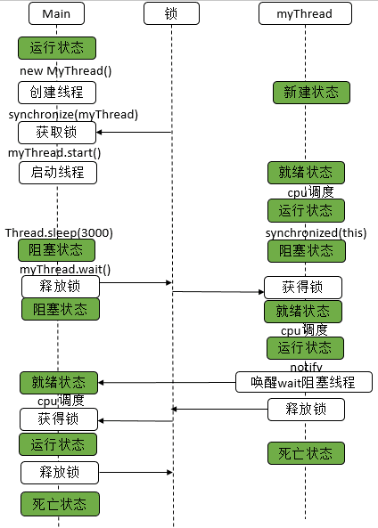

# JUC锁: LockSupport详解

## 带着BAT大厂的面试问题去理解

- 为什么LockSupport也是核心基础类? AQS框架借助于两个类：Unsafe(提供CAS操作)和LockSupport(提供park/unpark操作)
- 写出分别通过wait/notify和LockSupport的park/unpark实现同步?
- LockSupport.park()会释放锁资源吗? 那么Condition.await()呢?
- Thread.sleep()、Object.wait()、Condition.await()、LockSupport.park()的区别? 重点
- 如果在wait()之前执行了notify()会怎样?
- 如果在park()之前执行了unpark()会怎样?

## LockSupport简介

LockSupport用来创建锁和其他同步类的基本线程阻塞原语。简而言之，当调用LockSupport.park时，表示当前线程将会等待，直至获得许可，当调用LockSupport.unpark时，必须把等待获得许可的线程作为参数进行传递，好让此线程继续运行。

## LockSupport源码分析

### 类的属性

```java
public class LockSupport {
    // Hotspot implementation via intrinsics API
    private static final sun.misc.Unsafe UNSAFE;
    // 表示内存偏移地址
    private static final long parkBlockerOffset;
    // 表示内存偏移地址
    private static final long SEED;
    // 表示内存偏移地址
    private static final long PROBE;
    // 表示内存偏移地址
    private static final long SECONDARY;
    
    static {
        try {
            // 获取Unsafe实例
            UNSAFE = sun.misc.Unsafe.getUnsafe();
            // 线程类类型
            Class<?> tk = Thread.class;
            // 获取Thread的parkBlocker字段的内存偏移地址
            parkBlockerOffset = UNSAFE.objectFieldOffset
                (tk.getDeclaredField("parkBlocker"));
            // 获取Thread的threadLocalRandomSeed字段的内存偏移地址
            SEED = UNSAFE.objectFieldOffset
                (tk.getDeclaredField("threadLocalRandomSeed"));
            // 获取Thread的threadLocalRandomProbe字段的内存偏移地址
            PROBE = UNSAFE.objectFieldOffset
                (tk.getDeclaredField("threadLocalRandomProbe"));
            // 获取Thread的threadLocalRandomSecondarySeed字段的内存偏移地址
            SECONDARY = UNSAFE.objectFieldOffset
                (tk.getDeclaredField("threadLocalRandomSecondarySeed"));
        } catch (Exception ex) { throw new Error(ex); }
    }
}
```

说明: UNSAFE字段表示sun.misc.Unsafe类，查看其源码，点击在这里，一般程序中不允许直接调用，而long型的表示实例对象相应字段在内存中的偏移地址，可以通过该偏移地址获取或者设置该字段的值。

### 类的构造函数

```java
// 私有构造函数，无法被实例化
private LockSupport() {}
```

说明: LockSupport只有一个私有构造函数，无法被实例化。

### 核心函数分析

在分析LockSupport函数之前，先引入sun.misc.Unsafe类中的park和unpark函数，因为LockSupport的核心函数都是基于Unsafe类中定义的park和unpark函数，下面给出两个函数的定义:

```java
public native void park(boolean isAbsolute, long time);
public native void unpark(Thread thread);
```

说明: 对两个函数的说明如下:

- park函数，阻塞线程，并且该线程在下列情况发生之前都会被阻塞: ① 调用unpark函数，释放该线程的许可。② 该线程被中断。③ 设置的时间到了。并且，当time为绝对时间时，isAbsolute为true，否则，isAbsolute为false。当time为0时，表示无限等待，直到unpark发生。
- unpark函数，释放线程的许可，即激活调用park后阻塞的线程。这个函数不是安全的，调用这个函数时要确保线程依旧存活。

#### park函数

park函数有两个重载版本，方法摘要如下

```java
public static void park()；
public static void park(Object blocker)；
```

说明: 两个函数的区别在于park()函数没有没有blocker，即没有设置线程的parkBlocker字段。park(Object)型函数如下。

```java
public static void park(Object blocker) {
    // 获取当前线程
    Thread t = Thread.currentThread();
    // 设置Blocker
    setBlocker(t, blocker);
    // 获取许可
    UNSAFE.park(false, 0L);
    // 重新可运行后再此设置Blocker
    setBlocker(t, null);
}
```

说明: 调用park函数时，首先获取当前线程，然后设置当前线程的parkBlocker字段，即调用setBlocker函数，之后调用Unsafe类的park函数，之后再调用setBlocker函数。那么问题来了，为什么要在此park函数中要调用两次setBlocker函数呢? 原因其实很简单，调用park函数时，当前线程首先设置好parkBlocker字段，然后再调用Unsafe的park函数，此后，当前线程就已经阻塞了，等待该线程的unpark函数被调用，所以后面的一个setBlocker函数无法运行，unpark函数被调用，该线程获得许可后，就可以继续运行了，也就运行第二个setBlocker，把该线程的parkBlocker字段设置为null，这样就完成了整个park函数的逻辑。如果没有第二个setBlocker，那么之后没有调用park(Object blocker)，而直接调用getBlocker函数，得到的还是前一个park(Object blocker)设置的blocker，显然是不符合逻辑的。总之，必须要保证在park(Object blocker)整个函数执行完后，该线程的parkBlocker字段又恢复为null。所以，park(Object)型函数里必须要调用setBlocker函数两次。setBlocker方法如下。

```java
private static void setBlocker(Thread t, Object arg) {
    // 设置线程t的parkBlocker字段的值为arg
    UNSAFE.putObject(t, parkBlockerOffset, arg);
}
```

说明: 此方法用于设置线程t的parkBlocker字段的值为arg。

另外一个无参重载版本，park()函数如下。

```java
public static void park() {
    // 获取许可，设置时间为无限长，直到可以获取许可
    UNSAFE.park(false, 0L);
}
```

说明: 调用了park函数后，会禁用当前线程，除非许可可用。在以下三种情况之一发生之前，当前线程都将处于休眠状态，即下列情况发生时，当前线程会获取许可，可以继续运行。

- 其他某个线程将当前线程作为目标调用 unpark。
- 其他某个线程中断当前线程。
- 该调用不合逻辑地(即毫无理由地)返回。

#### parkNanos函数

此函数表示在许可可用前禁用当前线程，并最多等待指定的等待时间。具体函数如下。

```java
public static void parkNanos(Object blocker, long nanos) {
    if (nanos > 0) { // 时间大于0
        // 获取当前线程
        Thread t = Thread.currentThread();
        // 设置Blocker
        setBlocker(t, blocker);
        // 获取许可，并设置了时间
        UNSAFE.park(false, nanos);
        // 设置许可
        setBlocker(t, null);
    }
}
```

说明: 该函数也是调用了两次setBlocker函数，nanos参数表示相对时间，表示等待多长时间。

#### parkUntil函数

此函数表示在指定的时限前禁用当前线程，除非许可可用, 具体函数如下:

```java
public static void parkUntil(Object blocker, long deadline) {
    // 获取当前线程
    Thread t = Thread.currentThread();
    // 设置Blocker
    setBlocker(t, blocker);
    UNSAFE.park(true, deadline);
    // 设置Blocker为null
    setBlocker(t, null);
}
```

说明: 该函数也调用了两次setBlocker函数，deadline参数表示绝对时间，表示指定的时间。

#### unpark函数

此函数表示如果给定线程的许可尚不可用，则使其可用。如果线程在 park 上受阻塞，则它将解除其阻塞状态。否则，保证下一次调用 park 不会受阻塞。如果给定线程尚未启动，则无法保证此操作有任何效果。具体函数如下:

```java
public static void unpark(Thread thread) {
    if (thread != null) // 线程为不空
        UNSAFE.unpark(thread); // 释放该线程许可
}
```

说明: 释放许可，指定线程可以继续运行。

## LockSupport示例说明

### 使用wait/notify实现线程同步

```java
class MyThread extends Thread {
    
    public void run() {
        synchronized (this) {
            System.out.println("before notify");            
            notify();
            System.out.println("after notify");    
        }
    }
}

public class WaitAndNotifyDemo {
    public static void main(String[] args) throws InterruptedException {
        MyThread myThread = new MyThread();            
        synchronized (myThread) {
            try {        
                myThread.start();
                // 主线程睡眠3s
                Thread.sleep(3000);
                System.out.println("before wait");
                // 阻塞主线程
                myThread.wait();
                System.out.println("after wait");
            } catch (InterruptedException e) {
                e.printStackTrace();
            }            
        }        
    }
}
```

运行结果

```html
before wait
before notify
after notify
after wait
```

说明: 具体的流程图如下



使用wait/notify实现同步时，必须先调用wait，后调用notify，如果先调用notify，再调用wait，将起不了作用。具体代码如下

```java
class MyThread extends Thread {
    public void run() {
        synchronized (this) {
            System.out.println("before notify");            
            notify();
            System.out.println("after notify");    
        }
    }
}

public class WaitAndNotifyDemo {
    public static void main(String[] args) throws InterruptedException {
        MyThread myThread = new MyThread();        
        myThread.start();
        // 主线程睡眠3s
        Thread.sleep(3000);
        synchronized (myThread) {
            try {        
                System.out.println("before wait");
                // 阻塞主线程
                myThread.wait();
                System.out.println("after wait");
            } catch (InterruptedException e) {
                e.printStackTrace();
            }            
        }        
    }
}
```

运行结果:

```html
before notify
after notify
before wait
```

说明: 由于先调用了notify，再调用的wait，此时主线程还是会一直阻塞。

### 使用park/unpark实现线程同步

### 中断响应

## 更深入的理解

### Thread.sleep()和Object.wait()的区别

### Object.wait()和Condition.await()的区别

### Thread.sleep()和LockSupport.park()的区别

### Object.wait()和LockSupport.park()的区别

#### 如果在wait()之前执行了notify()会怎样?

#### 如果在park()之前执行了unpark()会怎样?

### LockSupport.park()会释放锁资源吗?

## 参考文章

