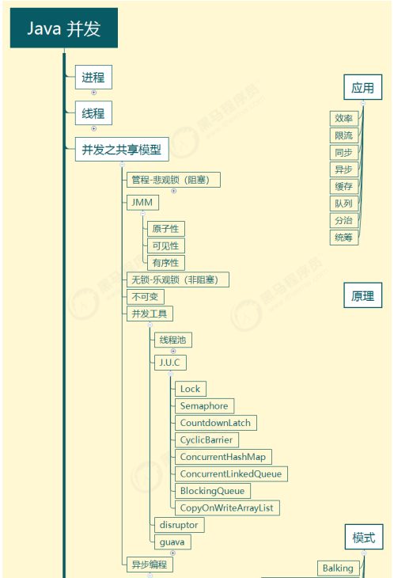
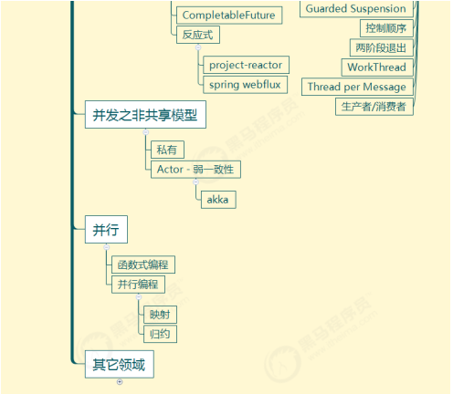
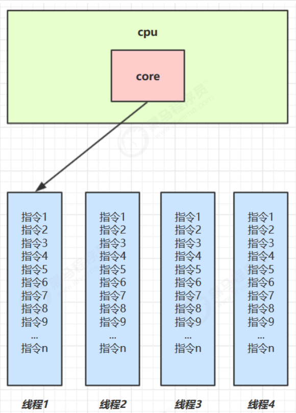
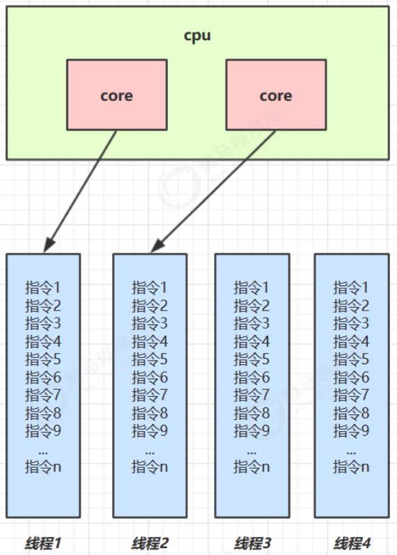
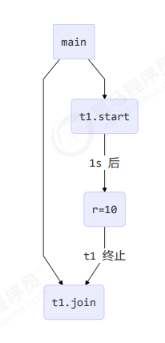
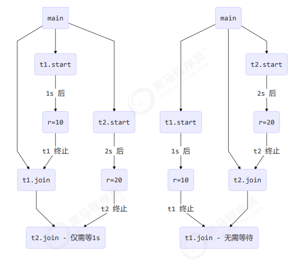
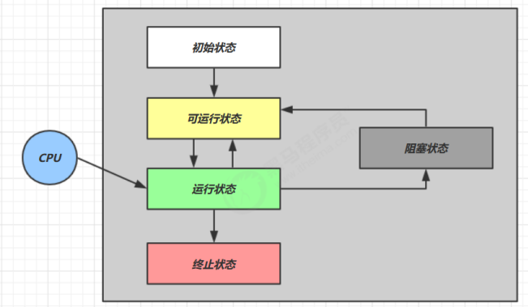
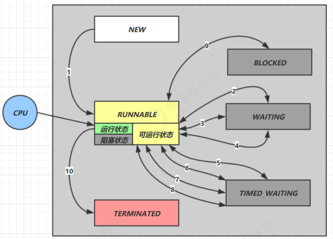
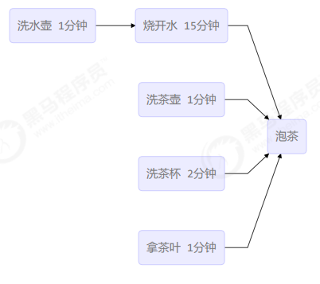
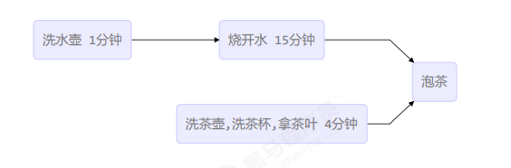

# 并发编程

## 1.概览 

### 1.1 这门课讲什么?

这门课中的【并发】一词涵盖了在 Java 平台上的 

- 进程
- 线程
- 并发
- 并行

以及 Java 并发工具、并发问题以及解决方案，同时我也会讲解一些其它领域的并发

### 1.2 为什么学这么课?

我工作中用不到并发啊？

### 1.3 课程特色

本门课程以并发、并行为主线，穿插讲解：

- **$\textcolor{PineGreen}{应用} $**- 结合实际
- **$\textcolor{Blue}{原理} $**- 了然于胸
- **$\textcolor{OrangeRed}{模式} $** - 正确姿势





### 1.4 预备知识 

- 希望你不是一个初学者
- 线程安全问题，需要你接触过 Java Web 开发、Jdbc 开发、Web 服务器、分布式框架时才会遇到
- 基于 JDK 8，最好对函数式编程、lambda 有一定了解
- 采用了 slf4j 打印日志，这是好的实践
- 采用了 lombok 简化 java bean 编写
- 给每个线程好名字，这也是一项好的实践

pom.xml 依赖如下

```xml
<properties>
    <maven.compiler.source>1.8</maven.compiler.source>
    <maven.compiler.target>1.8</maven.compiler.target>
</properties>

<dependencies>
	<dependency>
	<groupId>org.projectlombok</groupId>
	<artifactId>lombok</artifactId>
	<version>1.18.10</version>
	</dependency>
    
    <dependency>
    <groupId>ch.qos.logback</groupId>
    <artifactId>logback-classic</artifactId>
    <version>1.2.3</version>
    </dependency>
</dependencies>
```

logback.xml 配置如下

```xml
<?xml version="1.0" encoding="UTF-8"?>
<configuration
 	xmlns="http://ch.qos.logback/xml/ns/logback"
 	xmlns:xsi="http://www.w3.org/2001/XMLSchema-instance"
 	xsi:schemaLocation="http://ch.qos.logback/xml/ns/logback logback.xsd">
    
     <appender name="STDOUT" class="ch.qos.logback.core.ConsoleAppender">
         <encoder>
         	<pattern>%date{HH:mm:ss} [%t] %logger - %m%n</pattern>
         </encoder>
     </appender>
    
     <logger name="c" level="debug" additivity="false">
     	<appender-ref ref="STDOUT"/>
     </logger>
    
     <root level="ERROR">
         <appender-ref ref="STDOUT"/>
     </root>
</configuration>
```

## 2.进程与线程

### 本章内容

- 进程和线程的概念
- 并行和并发的概念
- 线程基本应用

### 2.1进程与线程

#### 进程

- 程序由指令和数据组成，但这些指令要运行，数据要读写，就必须将指令加载至 CPU，数据加载至内存。在指令运行过程中还需要用到磁盘、网络等设备。进程就是用来加载指令、管理内存、管理 IO 的
- 当一个程序被运行，从磁盘加载这个程序的代码至内存，这时就开启了一个进程。
- 进程就可以视为程序的一个实例。大部分程序可以同时运行多个实例进程（例如记事本、画图、浏览器 等），也有的程序只能启动一个实例进程（例如网易云音乐、360 安全卫士等）

#### 线程

- 一个进程之内可以分为一到多个线程。
- 一个线程就是一个指令流，将指令流中的一条条指令以一定的顺序交给 CPU 执行 Java 中，线程作为最小调度单位，进程作为资源分配的最小单位。
- 在 windows 中进程是不活动的，只是作为线程的容器

#### 二者对比

- 进程基本上相互独立的，而线程存在于进程内，是进程的一个子集
- 进程拥有共享的资源，如内存空间等，供其内部的线程共享
- 进程间通信较为复杂
  - 同一台计算机的进程通信称为 IPC（Inter-process communication） 
  - 不同计算机之间的进程通信，需要通过网络，并遵守共同的协议，例如 HTTP

- 线程通信相对简单，因为它们共享进程内的内存，一个例子是多个线程可以访问同一个共享变量
- 线程更轻量，线程上下文切换成本一般上要比进程上下文切换低


### 2.2并行与并发

单核 cpu 下，线程实际还是==串行执行==的。操作系统中有一个组件叫做任务调度器，将 cpu 的时间片（windows 下时间片最小约为 15 毫秒）分给不同的程序使用，只是由于 cpu 在线程间（时间片很短）的切换非常快，人类感觉是==同时运行的==。总结为一句话就是：==微观串行，宏观并行==， 一般会将这种线程轮流使用 CPU 的做法称为并发， ==concurrent==

| CPU  | 时间片 1 | 时间片 2 | 时间片 3 | 时间片 4 |
| ---- | -------- | -------- | -------- | -------- |
| core | 线程 1   | 线程 2   | 线程 3   | 线程 4   |



多核 cpu下，每个 核（core） 都可以调度运行线程，这时候线程可以是并行的。

| CPU   | 时间片 1 | 时间片 2 | 时间片 3 | 时间片 4 |
| ----- | -------- | -------- | -------- | -------- |
| core1 | 线程 1   | 线程 1   | 线程 3   | 线程 3   |
| core2 | 线程 2   | 线程 4   | 线程 2   | 线程 4   |



引用 Rob Pike 的一段描述：

- 并发（concurrent）是同一时间应对（dealing with）多件事情的能力
- 并行（parallel）是同一时间动手做（doing）多件事情的能力

例子 

- 家庭主妇做饭、打扫卫生、给孩子喂奶，她一个人轮流交替做这多件事，这时就是并发
- 家庭主妇雇了个保姆，她们一起这些事，这时既有并发，也有并行（这时会产生竞争，例如锅只有一口，一 个人用锅时，另一个人就得等待）
- 雇了3个保姆，一个专做饭、一个专打扫卫生、一个专喂奶，互不干扰，这时是并行


### 2.3 应用 

**$\textcolor{JungleGreen}{* 应用之异步调用（案例1）} $**

以调用方角度来讲，如果

- 需要等待结果返回，才能继续运行就是同步
- 不需要等待结果返回，就能继续运行就是异步

##### 1)设计

多线程可以让方法执行变为异步的（即不要巴巴干等着）比如说读取磁盘文件时，假设读取操作花费了 5 秒钟，如 果没有线程调度机制，这 5 秒 cpu 什么都做不了，其它代码都得暂停...

##### 2)结论

- 比如在项目中，视频文件需要转换格式等操作比较费时，这时开一个新线程处理视频转换，避免阻塞主线程
- tomcat 的异步 servlet 也是类似的目的，让用户线程处理耗时较长的操作，避免阻塞 tomcat 的工作线程
- ui 程序中，开线程进行其他操作，避免阻塞 ui 线程


**$\textcolor{JungleGreen}{*应用之提高效率（案例1）} $**

充分利用多核 cpu 的优势，提高运行效率。想象下面的场景，执行 3 个计算，最后将计算结果汇总。

```
计算 1 花费 10 ms
计算 2 花费 11 ms
计算 3 花费 9 ms
汇总需要 1 ms
```

- 如果是串行执行，那么总共花费的时间是 10 + 11 + 9 + 1 = ==31ms==
- 但如果是四核 cpu，各个核心分别使用线程 1 执行计算 1，线程 2 执行计算 2，线程 3 执行计算 3，那么 3 个 线程是并行的，花费时间只取决于最长的那个线程运行的时间，即 11ms 最后加上汇总时间只会花费==12ms==

:warning:注意 需要在多核 cpu 才能提高效率，单核仍然时是轮流执行 

##### 1）设计

**$\textcolor{JungleGreen}{代码见【*应用之效率-案例1】} $**

##### 2）结论 

1. 单核 cpu 下，多线程不能实际提高程序运行效率，只是为了能够在不同的任务之间切换，不同线程轮流使用 cpu ，不至于一个线程总占用 cpu，别的线程没法干活

2. 多核 cpu 可以并行跑多个线程，但能否提高程序运行效率还是要分情况的

   - 有些任务，经过精心设计，将任务拆分，并行执行，当然可以提高程序的运行效率。但不是所有计算任务都能拆分（参考后文的【阿姆达尔定律】）

   - 也不是所有任务都需要拆分，任务的目的如果不同，谈拆分和效率没啥意义

3. IO 操作不占用 cpu，只是我们一般拷贝文件使用的是【阻塞 IO】，这时相当于线程虽然不用 cpu，但需要一直等待 IO 结束，没能充分利用线程。所以才有后面的【非阻塞 IO】和【异步 IO】优化

## 3.Java 线程

### 本章内容

- 创建和运行线程
- 查看线程
- 线程 API
- 线程状态

### 3.1 创建和运行线程

#### 方法一，直接使用 Thread

```java
// 创建线程对象
Thread t = new Thread() {
    public void run() {
    	// 要执行的任务
    }
};
// 启动线程
t.start();
```

例如：

```java
// 构造方法的参数是给线程指定名字，推荐
Thread t1 = new Thread("t1") {
	@Override
	// run 方法内实现了要执行的任务
    public void run() {
        log.debug("hello");
    }
};
t1.start();
```

输出

```java
19:19:00 [t1] c.ThreadStarter - hello
```

#### 方法二，使用 Runnable 配合

Thread 把【线程】和【任务】（要执行的代码）分开 Thread 代表线程 Runnable 可运行的任务（线程要执行的代码）

```java
Runnable runnable = new Runnable() {
    public void run(){
        // 要执行的任务
    }
};
// 创建线程对象
Thread t = new Thread(runnable);
// 启动线程
t.start(); 
```

例如：

```java
// 创建任务对象
Runnable task2 = new Runnable() {
    @Override
    public void run() {
        log.debug("hello");
    }
};
// 参数1 是任务对象; 参数2 是线程名字，推荐
Thread t2 = new Thread(task2, "t2");
t2.start();
```

输出

```java
19:19:00 [t2] c.ThreadStarter - hello
```

Java 8 以后可以使用 lambda 精简代码

```java
// 创建任务对象
Runnable task2 = () -> log.debug("hello");
// 参数1 是任务对象; 参数2 是线程名字，推荐
Thread t2 = new Thread(task2, "t2");
t2.start();
```

**$\textcolor{Purple}{* 原理之 Thread 与 Runnable 的关系} $**

分析 Thread 的源码，理清它与 Runnable 的关系

#### 小结

- 方法1 是把线程和任务合并在了一起，方法2 是把线程和任务分开了
- 用 Runnable 更容易与线程池等高级 API 配合
- 用 Runnable 让任务类脱离了 Thread 继承体系，更灵活

#### 方法三，FutureTask 配合 Thread

FutureTask 能够接收 Callable 类型的参数，用来处理有返回结果的情况

```java
// 创建任务对象
FutureTask<Integer> task3 = new FutureTask<>(() -> {
    log.debug("hello");
    return 100;
});
// 参数1 是任务对象; 参数2 是线程名字，推荐
new Thread(task3, "t3").start();
// 主线程阻塞，同步等待 task 执行完毕的结果
Integer result = task3.get();
log.debug("结果是:{}", result);
```

输出

```bas
19:22:27 [t3] c.ThreadStarter - hello
19:22:27 [main] c.ThreadStarter - 结果是:100
```

### 3.2 观察多个线程同时运行

主要是理解

- 交替执行
- 谁先谁后，不由我们控制

### 3.3 查看进程线程的方法

#### windows

- 任务管理器可以查看进程和线程数，也可以用来杀死进程
- ==tasklist== 查看进程
- ==taskkill== 杀死进程

#### linux

- ==ps -fe== 查看所有进程 
- ==ps -fT -p \<PID>== 查看某个进程（PID）的所有线程 
- ==kill== 杀死进程
- ==top== 按大写 H 切换是否显示线程 
- ==top -H -p \<PID>== 查看某个进程（PID）的所有线程

#### Java

- ==jps== 命令查看所有 Java 进程
- ==jstack \<PID>== 查看某个 Java 进程（PID）的所有线程状态
- ==jconsole== 来查看某个 Java 进程中线程的运行情况（图形界面）

##### jconsole 远程监控配置

- 需要以如下方式运行你的 java 类

```bash
java -Djava.rmi.server.hostname=`ip地址` -Dcom.sun.management.jmxremote -
Dcom.sun.management.jmxremote.port=`连接端口` -Dcom.sun.management.jmxremote.ssl=是否安全连接 -
Dcom.sun.management.jmxremote.authenticate=是否认证 java类
```

- 修改 /etc/hosts 文件将 127.0.0.1 映射至主机名

如果要认证访问，还需要做如下步骤

- 复制 jmxremote.password 文件
- 修改 jmxremote.password 和 jmxremote.access 文件的权限为 600 即文件所有者可读写
- 连接时填入 controlRole（用户名），R&D（密码）

### 3.4 原理之线程运行 

**$\textcolor{Purple}{* 原理之线程运行}$**

#### 栈与栈帧

Java Virtual Machine Stacks （Java 虚拟机栈）

我们都知道 JVM 中由堆、栈、方法区所组成，其中栈内存是给谁用的呢？其实就是线程，每个线程启动后，虚拟机就会为其分配一块栈内存。

- 每个栈由多个栈帧（Frame）组成，对应着每次方法调用时所占用的内存
- 每个线程只能有一个活动栈帧，对应着当前正在执行的那个方法

#### 线程上下文切换（Thread Context Switch）

因为以下一些原因导致 cpu 不再执行当前的线程，转而执行另一个线程的代码

- 线程的 cpu 时间片用完
- 垃圾回收
- 有更高优先级的线程需要运行
- 线程自己调用了 sleep、yield、wait、join、park、synchronized、lock 等方法

当 Context Switch 发生时，需要由操作系统保存当前线程的状态，并恢复另一个线程的状态，Java 中对应的概念就是程序计数器（Program Counter Register），它的作用是记住下一条 jvm 指令的执行地址，是线程私有的

- 状态包括程序计数器、虚拟机栈中每个栈帧的信息，如局部变量、操作数栈、返回地址等
- Context Switch 频繁发生会影响性能

### 3.5 常见方法

| 方法名           | static | 功能说明                                                     | 注意                                                         |
| ---------------- | ------ | ------------------------------------------------------------ | ------------------------------------------------------------ |
| start()          |        | 启动一个新线程，在新的线程运行 run 方法中的代码              | start 方法只是让线程进入就绪，里面代码不一定立刻运行（CPU 的时间片还没分给它）。每个线程对象的 start方法只能调用一次，如果调用了多次会出现 IllegalThreadStateException. |
| run()            |        | 新线程启动后会调用的方法                                     | 如果在构造 Thread 对象时传递了 Runnable 参数，则线程启动后会调用 Runnable 中的 run 方法，否则默认不执行任何操作。但可以创建 Thread 的子类对象，来覆盖默认行为。 |
| join()           |        | 等待线程运行结束                                             |                                                              |
| join(long n)     |        | 等待线程运行结束,最多等待 n 毫秒                             |                                                              |
| getId()          |        | 获取线程长整型的 id                                          | id 唯一                                                      |
| getName()        |        | 获取线程名                                                   |                                                              |
| setName(String)  |        | 修改线程名                                                   |                                                              |
| getPriority()    |        | 获取线程优先级                                               |                                                              |
| setPriority(int) |        | 修改线程优先级                                               | java中规定线程优先级是1~10 的整数，较大的优先级能提高该线程被 CPU 调度的机率 |
| getState()       |        | 获取线程状态                                                 | Java 中线程状态是用 6 个 enum 表示，分别为：NEW, RUNNABLE, BLOCKED, WAITING, TIMED_WAITING,TERMINATED |
| isInterrupted()  |        | 判断是否被打断                                               | 不会清除==打断标记==                                         |
| isAlive()        |        | 线程是否存活 （还没有运行完 毕）                             |                                                              |
| interrupt()      |        | 打断线程                                                     | 如果被打断线程正在 sleep，wait，join 会导致被打断的线程抛出 InterruptedException，并清除==打断标记==；如果打断的正在运行的线程，则会设置==打断标记==；park 的线程被打断，也会设置打断标记 |
| interrupted()    | static | 判断当前线程是否被打断                                       | 会清除==打断标记==                                           |
| currentThread()  | static | 获取当前正在执行的线程                                       |                                                              |
| sleep(long n)    | static | 让当前执行的线程休眠n毫秒，休眠时让出 cpu 的时间片给其它线程 |                                                              |
| yield()          | static | 提示线程调度器让出当前线程对 CPU的使用                       | 主要是为了测试和调试                                         |

### 3.6 start 与 run

#### 调用 run

```java
public static void main(String[] args) {
    Thread t1 = new Thread("t1") {
        @Override
        public void run() {
            log.debug(Thread.currentThread().getName());
            FileReader.read(Constants.MP4_FULL_PATH);
        }
    };
    t1.run();
    log.debug("do other things ...");
}
```

输出

```bash
19:39:14 [main] c.TestStart - main
19:39:14 [main] c.FileReader - read [1.mp4] start ...
19:39:18 [main] c.FileReader - read [1.mp4] end ... cost: 4227 ms
19:39:18 [main] c.TestStart - do other things ...
```

程序仍在 main 线程运行， FileReader.read() 方法调用还是同步的

#### 调用 start

将上述代码的 t1.run() 改为

```java
t1.start();
```

输出

```bash
19:41:30 [main] c.TestStart - do other things ...
19:41:30 [t1] c.TestStart - t1
19:41:30 [t1] c.FileReader - read [1.mp4] start ...
19:41:35 [t1] c.FileReader - read [1.mp4] end ... cost: 4542 ms
```

程序在 t1 线程运行， FileReader.read() 方法调用是异步的

#### 小结

- 直接调用 run 是在主线程中执行了 run，没有启动新的线程
- 使用 start 是启动新的线程，通过新的线程间接执行 run 中的代码

### 3.7 sleep 与 yield

#### sleep

1. 调用 sleep 会让当前线程从 Running 进入 Timed Waiting 状态（阻塞）
2. 其它线程可以使用 interrupt 方法打断正在睡眠的线程，这时 sleep 方法会抛出 InterruptedException
3. 睡眠结束后的线程未必会立刻得到执行
4. 建议用 TimeUnit 的 sleep 代替 Thread 的 sleep 来获得更好的可读性

#### yield

1. 调用 yield 会让当前线程从 Running 进入 Runnable 就绪状态，然后调度执行其它线程
2. 具体的实现依赖于操作系统的任务调度器

#### 线程优先级

线程优先级会提示（hint）调度器优先调度该线程，但它仅仅是一个提示，调度器可以忽略它

如果 cpu 比较忙，那么优先级高的线程会获得更多的时间片，但 cpu 闲时，优先级几乎没作用

```java
Runnable task1 = () -> {
    int count = 0;
    for (;;) {
        System.out.println("---->1 " + count++);
    }
};
Runnable task2 = () -> {
    int count = 0;
    for (;;) {
        // Thread.yield();
        System.out.println(" ---->2 " + count++);
    }
};
Thread t1 = new Thread(task1, "t1");
Thread t2 = new Thread(task2, "t2");
// t1.setPriority(Thread.MIN_PRIORITY);
// t2.setPriority(Thread.MAX_PRIORITY);
t1.start();
t2.start();
```

**$\textcolor{JungleGreen}{*应用之效率（案例2）} $**

### 3.8 join 方法详解

#### 为什么需要 join

下面的代码执行，打印 r 是什么？

```java
static int r = 0;
public static void main(String[] args) throws InterruptedException {
    test1();
}
private static void test1() throws InterruptedException {
    log.debug("开始");
    Thread t1 = new Thread(() -> {
        log.debug("开始");
        sleep(1);
        log.debug("结束");
        r = 10;
    });
    t1.start();
    log.debug("结果为:{}", r);
    log.debug("结束");
}
```

分析

- 因为主线程和线程 t1 是并行执行的，t1 线程需要 1 秒之后才能算出 r=10
- 而主线程一开始就要打印 r 的结果，所以只能打印出 r=0

解决方法

- 用 sleep 行不行？为什么？
- 用 join，加在 t1.start() 之后即可

**$\textcolor{JungleGreen}{*应用之同步（案例1)} $**

以调用方角度来讲，如果

- 需要等待结果返回，才能继续运行就是同步
- 不需要等待结果返回，就能继续运行就是异步



#### 等待多个结果

问，下面代码 cost 大约多少秒？

```java
static int r1 = 0;
static int r2 = 0;
public static void main(String[] args) throws InterruptedException {
    test2();
}
private static void test2() throws InterruptedException {
    Thread t1 = new Thread(() -> {
        sleep(1);
        r1 = 10;
    });
    Thread t2 = new Thread(() -> {
        sleep(2);
        r2 = 20;
    });
    long start = System.currentTimeMillis();
    t1.start();
    t2.start();
    t1.join();
    t2.join();
    long end = System.currentTimeMillis();
    log.debug("r1: {} r2: {} cost: {}", r1, r2, end - start);
}
```

分析如下

- 第一个 join：等待 t1 时, t2 并没有停止, 而在运行
- 第二个 join：1s 后, 执行到此, t2 也运行了 1s, 因此也只需再等待 1s

如果颠倒两个 join 呢？

最终都是输出

```basic
20:45:43.239 [main] c.TestJoin - r1: 10 r2: 20 cost: 2005
```



#### 有时效的 join

等够时间

```java
static int r1 = 0;
static int r2 = 0;
public static void main(String[] args) throws InterruptedException {
    test3();
}
public static void test3() throws InterruptedException {
    Thread t1 = new Thread(() -> {
        sleep(1);
        r1 = 10;
    });
    long start = System.currentTimeMillis();
    t1.start();
    // 线程执行结束会导致 join 结束
    t1.join(1500);
    long end = System.currentTimeMillis();
    log.debug("r1: {} r2: {} cost: {}", r1, r2, end - start);
}
```

输出

```basic
20:48:01.320 [main] c.TestJoin - r1: 10 r2: 0 cost: 1010
```

没等够时间

```java
static int r1 = 0;
static int r2 = 0;
public static void main(String[] args) throws InterruptedException {
    test3();
}
public static void test3() throws InterruptedException {
    Thread t1 = new Thread(() -> {
        sleep(2);
        r1 = 10;
    });
    long start = System.currentTimeMillis();
    t1.start();
    // 线程执行结束会导致 join 结束
    t1.join(1500);
    long end = System.currentTimeMillis();
    log.debug("r1: {} r2: {} cost: {}", r1, r2, end - start);
}
```

输出

```basic
20:52:15.623 [main] c.TestJoin - r1: 0 r2: 0 cost: 1502
```

### 3.9 interrupt 方法详解

#### 打断 sleep，wait，join 的线程

这几个方法都会让线程进入阻塞状态

打断 sleep 的线程, 会清空打断状态，以 sleep 为例

```java
private static void test1() throws InterruptedException {
    Thread t1 = new Thread(()->{
        sleep(1);
    }, "t1");
    t1.start();
    sleep(0.5);
    t1.interrupt();
    log.debug(" 打断状态: {}", t1.isInterrupted());
}
```

输出

```java
java.lang.InterruptedException: sleep interrupted
 at java.lang.Thread.sleep(Native Method)
 at java.lang.Thread.sleep(Thread.java:340)
 at java.util.concurrent.TimeUnit.sleep(TimeUnit.java:386)
 at cn.itcast.n2.util.Sleeper.sleep(Sleeper.java:8)
 at cn.itcast.n4.TestInterrupt.lambda$test1$3(TestInterrupt.java:59)
 at java.lang.Thread.run(Thread.java:745)
21:18:10.374 [main] c.TestInterrupt - 打断状态: false
```

#### 打断正常运行的线程

打断正常运行的线程, 不会清空打断状态

```java
private static void test2() throws InterruptedException {
    Thread t2 = new Thread(()->{
        while(true) {
            Thread current = Thread.currentThread();
            boolean interrupted = current.isInterrupted();
            if(interrupted) {
                log.debug(" 打断状态: {}", interrupted);
                break;
            }
        }
    }, "t2");
    t2.start();
    sleep(0.5);
    t2.interrupt();
}
```

输出

```basic
20:57:37.964 [t2] c.TestInterrupt - 打断状态: true 

```

**$\textcolor{YellowOrange}{*模式之两阶段终止} $**

#### 打断 park 线程

打断 park 线程, 不会清空打断状态

```java
private static void test3() throws InterruptedException {
    Thread t1 = new Thread(() -> {
        log.debug("park...");
        LockSupport.park();
        log.debug("unpark...");
        log.debug("打断状态：{}", Thread.currentThread().isInterrupted());
    }, "t1");
    t1.start();
    sleep(0.5);
    t1.interrupt();
}
```

输出

```basic
21:11:52.795 [t1] c.TestInterrupt - park...
21:11:53.295 [t1] c.TestInterrupt - unpark...
21:11:53.295 [t1] c.TestInterrupt - 打断状态：true 
```

如果打断标记已经是 true, 则 park 会失效

```java
private static void test4() {
    Thread t1 = new Thread(() -> {
        for (int i = 0; i < 5; i++) {
            log.debug("park...");
            LockSupport.park();
            log.debug("打断状态：{}", Thread.currentThread().isInterrupted());
        }
    });
    t1.start();
    sleep(1);
    t1.interrupt();
}
```

输出

```basic
21:13:48.783 [Thread-0] c.TestInterrupt - park...
21:13:49.809 [Thread-0] c.TestInterrupt - 打断状态：true
21:13:49.812 [Thread-0] c.TestInterrupt - park...
21:13:49.813 [Thread-0] c.TestInterrupt - 打断状态：true
21:13:49.813 [Thread-0] c.TestInterrupt - park...
21:13:49.813 [Thread-0] c.TestInterrupt - 打断状态：true
21:13:49.813 [Thread-0] c.TestInterrupt - park...
21:13:49.813 [Thread-0] c.TestInterrupt - 打断状态：true
21:13:49.813 [Thread-0] c.TestInterrupt - park...
21:13:49.813 [Thread-0] c.TestInterrupt - 打断状态：true 
```

:six_pointed_star:提示：可以使用 Thread.interrupted() 清除打断状态

### 3.10 不推荐的方法

还有一些不推荐使用的方法，这些方法已过时，容易破坏同步代码块，造成线程死锁

| 方法名    | static | 功能说明             |
| --------- | ------ | -------------------- |
| stop()    |        | 停止线程运行         |
| suspend() |        | 挂起（暂停）线程运行 |
| resume()  |        | 恢复线程运行         |

### 3.11 主线程与守护线程

默认情况下，Java 进程需要等待所有线程都运行结束，才会结束。有一种特殊的线程叫做守护线程，只要其它非守护线程运行结束了，即使守护线程的代码没有执行完，也会强制结束。

例：

```java
log.debug("开始运行...");
Thread t1 = new Thread(() -> {
    log.debug("开始运行...");
    sleep(2);
    log.debug("运行结束...");
}, "daemon");
// 设置该线程为守护线程
t1.setDaemon(true);
t1.start();
sleep(1);
log.debug("运行结束...");
```

:warning:注意：

- 垃圾回收器线程就是一种守护线程
- Tomcat 中的 Acceptor 和 Poller 线程都是守护线程，所以 Tomcat 接收到 shutdown 命令后，不会等待它们处理完当前请求

### 3.12 五种状态

这是从**操作系统**层面来描述的



- 【初始状态】仅是在语言层面创建了线程对象，还未与操作系统线程关联
- 【可运行状态】（就绪状态）指该线程已经被创建（与操作系统线程关联），可以由 CPU 调度执行
- 【运行状态】指获取了 CPU 时间片运行中的状态
  - 当 CPU 时间片用完，会从【运行状态】转换至【可运行状态】，会导致线程的上下文切换
- 【阻塞状态】
  - 如果调用了阻塞 API，如 BIO 读写文件，这时该线程实际不会用到 CPU，会导致线程上下文切换，进入【阻塞状态】
  - 等 BIO 操作完毕，会由操作系统唤醒阻塞的线程，转换至【可运行状态】
  - 与【可运行状态】的区别是，对【阻塞状态】的线程来说只要它们一直不唤醒，调度器就一直不会考虑调度它们
- 【终止状态】表示线程已经执行完毕，生命周期已经结束，不会再转换为其它状态

### 3.13 六种状态

这是从 **Java API** 层面来描述的

根据 Thread.State 枚举，分为六种状态



- ==NEW== 线程刚被创建，但是还没有调用 start() 方法
- ==RUNNABLE== 当调用了 start() 方法之后，注意，**Java API** 层面的 RUNNABLE 状态涵盖了 操作系统 层面的 【可运行状态】、【运行状态】和【阻塞状态】（由于 BIO 导致的线程阻塞，在 Java 里无法区分，仍然认为是可运行）
- ==BLOCKED==，===WAITING==，==TIMED_WAITING== 都是 **Java API** 层面对【阻塞状态】的细分，后面会在状态转换一节详述
- ==TERMINATED== 当线程代码运行结束

### 3.14 习题

- 阅读华罗庚《统筹方法》，给出烧水泡茶的多线程解决方案，提示
  - 参考图二，用两个线程（两个人协作）模拟烧水泡茶过程
  - 文中办法乙、丙都相当于任务串行
- 而图一相当于启动了 4 个线程，有点浪费 用 sleep(n) 模拟洗茶壶、洗水壶等耗费的时间

附：华罗庚《统筹方法》

>统筹方法，是一种安排工作进程的数学方法。它的实用范围极广泛，在企业管理和基本建设中，以及关系复 杂的科研项目的组织与管理中，都可以应用。
>
>怎样应用呢？主要是把工序安排好。
>
>比如，想泡壶茶喝。当时的情况是：开水没有；水壶要洗，茶壶、茶杯要洗；火已生了，茶叶也有了。怎么 办？
>
>- 办法甲：洗好水壶，灌上凉水，放在火上；在等待水开的时间里，洗茶壶、洗茶杯、拿茶叶；等水开了，泡茶喝。
>- 办法乙：先做好一些准备工作，洗水壶，洗茶壶茶杯，拿茶叶；一切就绪，灌水烧水；坐待水开了，泡茶喝。
>- 办法丙：洗净水壶，灌上凉水，放在火上，坐待水开；水开了之后，急急忙忙找茶叶，洗茶壶茶杯，泡茶喝。
>
>哪一种办法省时间？我们能一眼看出，第一种办法好，后两种办法都窝了工。
>
>这是小事，但这是引子，可以引出生产管理等方面有用的方法来。
>
>水壶不洗，不能烧开水，因而洗水壶是烧开水的前提。没开水、没茶叶、不洗茶壶茶杯，就不能泡茶，因而 这些又是泡茶的前提。它们的相互关系，可以用下边的箭头图来表示：
>
>
>
>从这个图上可以一眼看出，办法甲总共要16分钟（而办法乙、丙需要20分钟）。如果要缩短工时、提高工作 效率，应当主要抓烧开水这个环节，而不是抓拿茶叶等环节。同时，洗茶壶茶杯、拿茶叶总共不过4分钟，大可利用“等水开”的时间来做。
>
>是的，这好像是废话，卑之无甚高论。有如走路要用两条腿走，吃饭要一口一口吃，这些道理谁都懂得。但稍有变化，临事而迷的情况，常常是存在的。在近代工业的错综复杂的工艺过程中，往往就不是像泡茶喝这么简单了。任务多了，几百几千，甚至有好几万个任务。关系多了，错综复杂，千头万绪，往往出现“万事俱备，只欠东风”的情况。由于一两个零件没完成，耽误了一台复杂机器的出厂时间。或往往因为抓的不是关 键，连夜三班，急急忙忙，完成这一环节之后，还得等待旁的环节才能装配。
>
>洗茶壶，洗茶杯，拿茶叶，或先或后，关系不大，而且同是一个人的活儿，因而可以合并成为：
>
>
>
>看来这是“小题大做”，但在工作环节太多的时候，这样做就非常必要了。
>
>这里讲的主要是时间方面的事，但在具体生产实践中，还有其他方面的许多事。这种方法虽然不一定能直接解决所有问题，但是，我们利用这种方法来考虑问题，也是不无裨益的。

**$\textcolor{JungleGreen}{*应用之统筹（烧水泡茶）} $**

### 本章小结

本章的重点在于掌握

- 线程创建
- 线程重要 api，如 start，run，sleep，join，interrupt 等
- 线程状态
- **$\textcolor{JungleGreen}{应用方面}$**
  - 异步调用：主线程执行期间，其它线程异步执行耗时操作
  - 提高效率：并行计算，缩短运算时间
  - 同步等待：join
  - 统筹规划：合理使用线程，得到最优效果
- **$\textcolor{Purple}{原理方面}$**
  - 线程运行流程：栈、栈帧、上下文切换、程序计数器
  - Thread 两种创建方式的源码
- **$\textcolor{YellowOrange}{模式方面}$**
  - 终止模式之两阶段终止