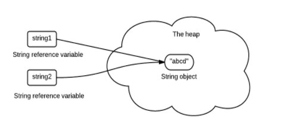
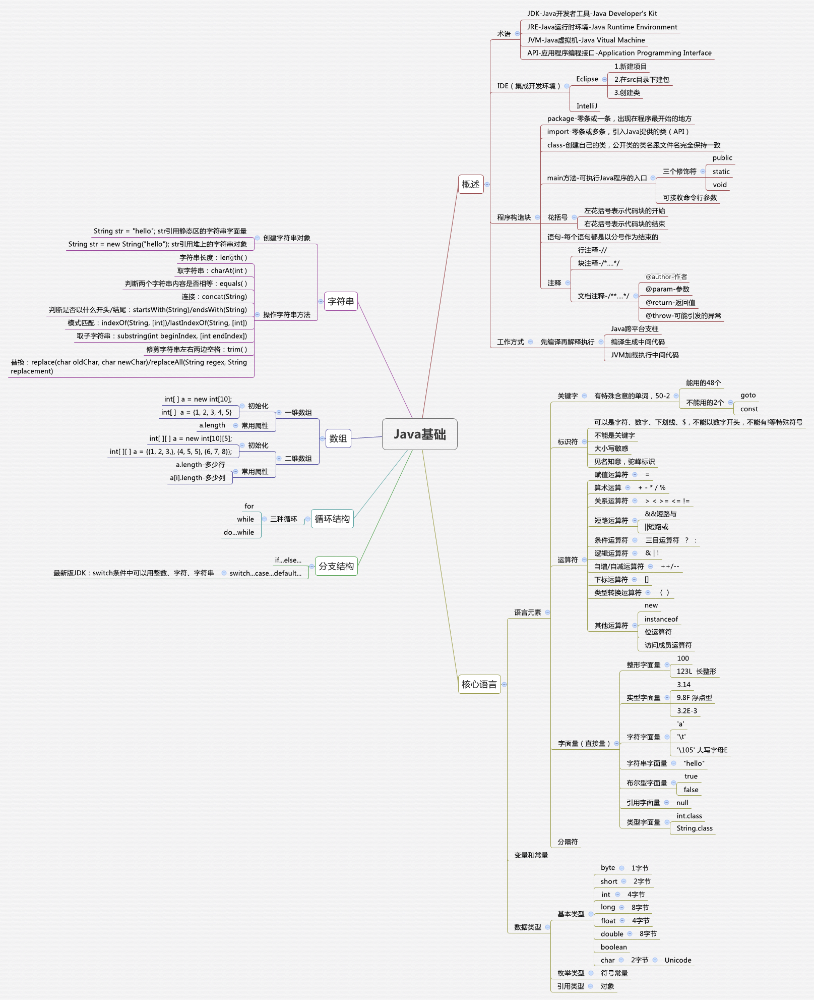

# Java基础

## Java基础-面向对象

:notebook:&emsp;什么是面向对象(OOP)？一切皆对象,面向过程是具体化的面向对象,面向对象是模型化的面向过程。

#### **1.面向对象三大特性**

##### :one:封装

利用抽象数据类型将数据和基于数据的操作封装在一起，使其构成一个不可分割的独立实体。数据被保护在抽象数据类型的内部，尽可能地隐藏内部的细节，只保留一些对外接口使之与外部发生联系。用户无需知道对象内部的细节，但可以通过对象对外提供的接口来访问该对象。封装隐藏对象的属性和实现细节，仅对外提供公共访问方式，将变化隔离、便于使用，提高复用性和安全性。

**优点:**

- 减少耦合: 可以独立地开发、测试、优化、使用、理解和修改
- 减轻维护的负担: 可以更容易被程序员理解，并且在调试的时候可以不影响其他模块
- 有效地调节性能: 可以通过剖析确定哪些模块影响了系统的性能
- 提高软件的可重用性
- 降低了构建大型系统的风险: 即使整个系统不可用，但是这些独立的模块却有可能是可用的

##### :two:继承

继承实现了`IS-A`关系，例如 Cat 和 Animal 就是一种 IS-A 关系，因此 Cat 可以继承自 Animal，从而获得 Animal 非 private 的属性和方法。

继承应该遵循里氏替换原则，子类对象必须能够替换掉所有父类对象。

Cat 可以当做 Animal 来使用，也就是说可以使用 Animal 引用 Cat 对象。父类引用指向子类对象称为`向上转型` 。

`Animal animal = new Cat();`

##### :three:多态

多态分为`编译时多态`和`运行时多态`:

- 编译时多态主要指方法的重载
- 运行时多态指程序中定义的对象引用所指向的具体类型在运行期间才确定

运行时多态有三个条件:

- 继承
- 覆盖(重写)
- 向上转型

#### **2.面向对象五大原则:**

##### :one:单一职责

类的功能要单一，一个类只实现一个功能。

##### :two:开放封闭

一个模块对于拓展是开放的，对于修改是封闭的。

##### :three:里氏替换

子类可以替换父类出现在父类能够出现的任何地方。

##### :four:依赖倒置

高层次的模块不应该依赖于低层次的模块，他们都应该依赖于抽象。抽象不应该依赖于具体实现，具体实现应该依赖于抽象。

##### :five:接口分离

设计时采用多个与特定客户类有关的接口比采用一个通用的接口要好。

#### 3.类图关系

:walking:类图可以使用 [PlantUML (opens new window)](https://www.planttext.com/)绘制，更多语法及使用: http://plantuml.com/ 。

##### :one:泛化关系 (Generalization)

用来描述继承关系，在 Java 中使用 extends 关键字。

##### :two:实现关系 (Realization)

用来实现一个接口，在 Java 中使用 implement 关键字。

##### :three:聚合关系 (Aggregation)

表示整体由部分组成，但是整体和部分不是强依赖的，整体不存在了部分还是会存在。

##### :four:组合关系 (Composition)

和聚合不同，组合中整体和部分是强依赖的，整体不存在了部分也不存在了。比如公司和部门，公司没了部门就不存在了。但是公司和员工就属于聚合关系了，因为公司没了员工还在。

##### :five:关联关系 (Association)

表示不同类对象之间有关联，这是一种静态关系，与运行过程的状态无关，在最开始就可以确定。因此也可以用 1 对 1、多对 1、多对多这种关联关系来表示。比如学生和学校就是一种关联关系，一个学校可以有很多学生，但是一个学生只属于一个学校，因此这是一种多对一的关系，在运行开始之前就可以确定。

##### :six:依赖关系 (Dependency)

和关联关系不同的是，依赖关系是在运行过程中起作用的。A 类和 B 类是依赖关系主要有三种形式:

- A 类是 B 类中的(某中方法的)局部变量；
- A 类是 B 类方法当中的一个参数；
- A 类向 B 类发送消息，从而影响 B 类发生变化；

#### 4.耦合

高内聚，低耦合.

## Java基础-知识点

#### 1.数据类型

##### :one:包装类型

八个基本类型:基本类型都有对应的包装类型，基本类型与其对应的包装类型之间的赋值使用自动装箱与拆箱完成。

- boolean/1
- byte/8
- char/16
- short/16
- int/32
- float/32
- long/64
- double/64

##### :two:缓存池

`new Integer(123)` 与 `Integer.valueOf(123)` 的区别在于:

- new Integer(123) 每次都会新建一个对象。
- Integer.valueOf(123) 会使用缓存池中的对象，多次调用会取得同一个对象的引用。

`valueOf()` 方法的实现比较简单，就是先判断值是否在缓存池中，如果在的话就直接返回缓存池的内容。

编译器会**在缓冲池范围内的基本类型**自动装箱过程调用 valueOf() 方法，因此多个 Integer 实例使用自动装箱来创建并且值相同，那么就会引用相同的对象。

:fleur_de_lis:基本类型对应的缓冲池如下：在使用这些基本类型对应的包装类型时，就可以直接使用缓冲池中的对象。

- boolean values true and false
- all byte values
- short values between -128 and 127
- int values between -128 and 127
- char in the range \u0000 to \u007F

#### 2.String

##### :one:概述

String 被声明为 final，因此它不可被继承。

内部使用 char 数组存储数据，该数组被声明为 final，这意味着 value 数组初始化之后就不能再引用其它数组。并且 String 内部没有改变 value 数组的方法，因此可以保证 String 不可变。

##### :two:不可变的好处

**1. 可以缓存 hash 值**

因为 String 的 hash 值经常被使用，例如 String 用做 HashMap 的 key。不可变的特性可以使得 hash 值也不可变，因此只需要进行一次计算。

**2. String Pool 的需要**

如果一个 String 对象已经被创建过了，那么就会从 String Pool 中取得引用。只有 String 是不可变的，才可能使用 String Pool。



**3. 安全性**

String 经常作为参数，String 不可变性可以保证参数不可变。例如在作为网络连接参数的情况下如果 String 是可变的，那么在网络连接过程中，String 被改变，改变 String 对象的那一方以为现在连接的是其它主机，而实际情况却不一定是。

**4. 线程安全**

String 不可变性天生具备线程安全，可以在多个线程中安全地使用。

##### :three:String,StringBuffer and StringBuilder

**1. 可变性**

- String 不可变
- StringBuffer 和 StringBuilder 可变

**2. 线程安全**

- String 不可变，因此是线程安全的
- StringBuilder 不是线程安全的
- StringBuffer 是线程安全的，内部使用 synchronized 进行同步

##### :four:String.intern()

使用 String.intern() 可以保证相同内容的字符串变量引用同一的内存对象。

下面示例中，s1 和 s2 采用 new String() 的方式新建了两个不同对象，而 s3 是通过 s1.intern() 方法取得一个对象引用。intern() 首先把 s1 引用的对象放到 String Pool(字符串常量池)中，然后返回这个对象引用。因此 s3 和 s1 引用的是同一个字符串常量池的对象。

```java
String s1 = new String("aaa");
String s2 = new String("aaa");
System.out.println(s1 == s2);           // false
String s3 = s1.intern();
System.out.println(s1.intern() == s3);  // true
```

如果是采用 "bbb" 这种使用双引号的形式创建字符串实例，会自动地将新建的对象放入 String Pool 中。

```java
String s4 = "bbb";
String s5 = "bbb";
System.out.println(s4 == s5);  // true
```

- **HotSpot中字符串常量池保存哪里？永久代？方法区还是堆区**？

1. 运行时常量池（Runtime Constant Pool）是虚拟机规范中是方法区的一部分，在加载类和结构到虚拟机后，就会创建对应的运行时常量池；而字符串常量池是这个过程中常量字符串的存放位置。所以从这个角度，字符串常量池属于虚拟机规范中的方法区，它是一个**逻辑上的概念**；而堆区，永久代以及元空间是实际的存放位置。
2. 不同的虚拟机对虚拟机的规范（比如方法区）是不一样的，只有 HotSpot 才有永久代的概念。
3. HotSpot也是发展的，由于[一些问题  (opens new window)](http://openjdk.java.net/jeps/122)的存在，HotSpot考虑逐渐去永久代，对于不同版本的JDK，**实际的存储位置**是有差异的，具体看如下表格：

| JDK版本      | 是否有永久代，字符串常量池放在哪里？                         | 方法区逻辑上规范，由哪些实际的部分实现的？                   |
| ------------ | ------------------------------------------------------------ | ------------------------------------------------------------ |
| jdk1.6及之前 | 有永久代，运行时常量池（包括字符串常量池），静态变量存放在永久代上 | 这个时期方法区在HotSpot中是由永久代来实现的，以至于**这个时期说方法区就是指永久代** |
| jdk1.7       | 有永久代，但已经逐步“去永久代”，字符串常量池、静态变量移除，保存在堆中； | 这个时期方法区在HotSpot中由**永久代**（类型信息、字段、方法、常量）和**堆**（字符串常量池、静态变量）共同实现 |
| jdk1.8及之后 | 取消永久代，类型信息、字段、方法、常量保存在本地内存的元空间，但字符串常量池、静态变量仍在堆中 | 这个时期方法区在HotSpot中由本地内存的**元空间**（类型信息、字段、方法、常量）和**堆**（字符串常量池、静态变量）共同实现 |

#### 3.运算

##### :one:参数传递

Java 的参数是以值传递的形式传入方法中，而不是引用传递。

以下代码中 Dog dog 的 dog 是一个指针，存储的是对象的地址。在将一个参数传入一个方法时，本质上是将对象的地址以值的方式传递到形参中。因此在方法中改变指针引用的对象，那么这两个指针此时指向的是完全不同的对象，一方改变其所指向对象的内容对另一方没有影响。

```java
public class PassByValueExample {
    public static void main(String[] args) {
        Dog dog = new Dog("A");
        System.out.println(dog.getObjectAddress()); // Dog@4554617c
        func(dog);
        System.out.println(dog.getObjectAddress()); // Dog@4554617c
        System.out.println(dog.getName());          // A
    }

    private static void func(Dog dog) {
        System.out.println(dog.getObjectAddress()); // Dog@4554617c
        dog = new Dog("B");
        System.out.println(dog.getObjectAddress()); // Dog@74a14482
        System.out.println(dog.getName());          // B
    }
}
```

但是如果在方法中改变对象的字段值会改变原对象该字段值，因为改变的是同一个地址指向的内容。

```java
class PassByValueExample {
    public static void main(String[] args) {
        Dog dog = new Dog("A");
        func(dog);
        System.out.println(dog.getName());          // B
    }

    private static void func(Dog dog) {
        dog.setName("B");
    }
}
```

##### :two:float and double

1.1 字面量属于 double 类型，不能直接将 1.1 直接赋值给 float 变量，因为这是向下转型。Java 不能隐式执行向下转型，因为这会使得精度降低。

1.1f 字面量才是 float 类型。

```java
// float f = 1.1;   
float f = 1.1f; 
```

##### :three:隐式类型转换

因为字面量 1 是 int 类型，它比 short 类型精度要高，因此不能隐式地将 int 类型下转型为 short 类型。

```java
short s1 = 1;
// s1 = s1 + 1; 
```

但是使用 += 运算符可以执行隐式类型转换。

```java
s1 += 1;
// 上面的语句相当于将 s1 + 1 的计算结果进行了向下转型:
s1 = (short) (s1 + 1);
```

##### :four:switch

从 Java 7 开始，可以在 switch 条件判断语句中使用 String 对象。

switch 不支持 long，是因为 switch 的设计初衷是对那些只有少数的几个值进行等值判断，如果值过于复杂，那么还是用 if 比较合适。

#### 4.继承

##### :one:访问权限

Java 中有三个访问权限修饰符: private、protected 以及 public，如果不加访问修饰符，表示包级可见。

可以对类或类中的成员(字段以及方法)加上访问修饰符。

- 类可见表示其它类可以用这个类创建实例对象。
- 成员可见表示其它类可以用这个类的实例对象访问到该成员；

protected 用于修饰成员，表示在继承体系中成员对于子类可见，但是这个访问修饰符对于类没有意义。

设计良好的模块会隐藏所有的实现细节，把它的 API 与它的实现清晰地隔离开来。模块之间只通过它们的 API 进行通信，一个模块不需要知道其他模块的内部工作情况，这个概念被称为信息隐藏或封装。因此访问权限应当尽可能地使每个类或者成员不被外界访问。

如果子类的方法重写了父类的方法，那么子类中该方法的访问级别不允许低于父类的访问级别。这是为了确保可以使用父类实例的地方都可以使用子类实例，也就是确保满足里氏替换原则。

字段决不能是公有的，因为这么做的话就失去了对这个字段修改行为的控制，客户端可以对其随意修改。例如下面的例子中，AccessExample 拥有 id 共有字段，如果在某个时刻，我们想要使用 int 去存储 id 字段，那么就需要去修改所有的客户端代码。

可以使用公有的 getter 和 setter 方法来替换公有字段，这样的话就可以控制对字段的修改行为。

但是也有例外，如果是包级私有的类或者私有的嵌套类，那么直接暴露成员不会有特别大的影响。

##### :two:抽象类与接口

**1. 抽象类**

抽象类和抽象方法都使用 abstract 关键字进行声明。抽象类一般会包含抽象方法，抽象方法一定位于抽象类中。

抽象类和普通类最大的区别是，抽象类不能被实例化，需要继承抽象类才能实例化其子类。

**2. 接口**

接口是抽象类的延伸，在 Java 8 之前，它可以看成是一个完全抽象的类，也就是说它不能有任何的方法实现。

从 Java 8 开始，接口也可以拥有默认的方法实现，这是因为不支持默认方法的接口的维护成本太高了。在 Java 8 之前，如果一个接口想要添加新的方法，那么要修改所有实现了该接口的类。

接口的成员(字段 + 方法)默认都是 public 的，并且不允许定义为 private 或者 protected。

接口的字段默认都是 static 和 final 的。

**3. 比较**

- 从设计层面上看，抽象类提供了一种 IS-A 关系，那么就必须满足里式替换原则，即子类对象必须能够替换掉所有父类对象。而接口更像是一种 LIKE-A 关系，它只是提供一种方法实现契约，并不要求接口和实现接口的类具有 IS-A 关系。
- 从使用上来看，一个类可以实现多个接口，但是不能继承多个抽象类。
- 接口的字段只能是 static 和 final 类型的，而抽象类的字段没有这种限制。
- 接口的成员只能是 public 的，而抽象类的成员可以有多种访问权限。

**4. 使用选择**

使用接口:

- 需要让不相关的类都实现一个方法，例如不相关的类都可以实现 Compareable 接口中的 compareTo() 方法；
- 需要使用多重继承。

使用抽象类:

- 需要在几个相关的类中共享代码。
- 需要能控制继承来的成员的访问权限，而不是都为 public。
- 需要继承非静态和非常量字段。

在很多情况下，接口优先于抽象类，因为接口没有抽象类严格的类层次结构要求，可以灵活地为一个类添加行为。并且从 Java 8 开始，接口也可以有默认的方法实现，使得修改接口的成本也变的很低。

##### :three:super

- 访问父类的构造函数: 可以使用 super() 函数访问父类的构造函数，从而委托父类完成一些初始化的工作。
- 访问父类的成员: 如果子类重写了父类的中某个方法的实现，可以通过使用 super 关键字来引用父类的方法实现。

##### :four:重写与重载

**1. 重写(Override)**

存在于继承体系中，指子类实现了一个与父类在方法声明上完全相同的一个方法。

为了满足里式替换原则，重写有以下两个限制:

- 子类方法的访问权限必须大于等于父类方法；
- 子类方法的返回类型必须是父类方法返回类型或为其子类型。

使用 @Override 注解，可以让编译器帮忙检查是否满足上面的两个限制条件。

**2. 重载(Overload)**

存在于同一个类中，指一个方法与已经存在的方法名称上相同，但是参数类型、个数、顺序至少有一个不同。

应该注意的是，返回值不同，其它都相同不算是重载。

#### 5.Object通用方法

##### :one:概述

著作权归https://pdai.tech所有。 链接：https://pdai.tech/md/java/basic/java-basic-lan-basic.html

```
public final native Class<?> getClass()

public native int hashCode()

public boolean equals(Object obj)

protected native Object clone() throws CloneNotSupportedException

public String toString()

public final native void notify()

public final native void notifyAll()

public final native void wait(long timeout) throws InterruptedException

public final void wait(long timeout, int nanos) throws InterruptedException

public final void wait() throws InterruptedException

protected void finalize() throws Throwable {}
```

##### :two:equals()

**1. 等价关系**

```java
// (一)自反性
x.equals(x); // true 

// (二)对称性
x.equals(y) == y.equals(x); // true

// (三)传递性
if (x.equals(y) && y.equals(z))
    x.equals(z); // true;

// (四)一致性 多次调用 equals() 方法结果不变
x.equals(y) == x.equals(y); // true

// (五)与 null 的比较 对任何不是 null 的对象 x 调用 x.equals(null) 结果都为 false
x.equals(null); // false;

```

**2. equals() 与 ==**

- 对于基本类型，== 判断两个值是否相等，基本类型没有 equals() 方法。
- 对于引用类型，== 判断两个变量是否引用同一个对象，而 equals() 判断引用的对象是否等价。

```java
Integer x = new Integer(1);
Integer y = new Integer(1);
System.out.println(x.equals(y)); // true
System.out.println(x == y);      // false
```

**3. 实现**

- 检查是否为同一个对象的引用，如果是直接返回 true；
- 检查是否是同一个类型，如果不是，直接返回 false；
- 将 Object 对象进行转型；
- 判断每个关键域是否相等。

```java
public class EqualExample {
    private int x;
    private int y;
    private int z;

    public EqualExample(int x, int y, int z) {
        this.x = x;
        this.y = y;
        this.z = z;
    }

    @Override
    public boolean equals(Object o) {
        if (this == o) return true;
        if (o == null || getClass() != o.getClass()) return false;

        EqualExample that = (EqualExample) o;

        if (x != that.x) return false;
        if (y != that.y) return false;
        return z == that.z;
    }
}
```

##### :three:hashCode()

hashCode() 返回散列值，而 equals() 是用来判断两个对象是否等价。等价的两个对象散列值一定相同，但是散列值相同的两个对象不一定等价。

在覆盖 equals() 方法时应当总是覆盖 hashCode() 方法，保证等价的两个对象散列值也相等。

下面的代码中，新建了两个等价的对象，并将它们添加到 HashSet 中。我们希望将这两个对象当成一样的，只在集合中添加一个对象，但是因为 EqualExample 没有实现 hasCode() 方法，因此这两个对象的散列值是不同的，最终导致集合添加了两个等价的对象。

```java
EqualExample e1 = new EqualExample(1, 1, 1);
EqualExample e2 = new EqualExample(1, 1, 1);
System.out.println(e1.equals(e2)); // true
HashSet<EqualExample> set = new HashSet<>();
set.add(e1);
set.add(e2);
System.out.println(set.size());   // 2  
```

理想的散列函数应当具有均匀性，即不相等的对象应当均匀分布到所有可能的散列值上。这就要求了散列函数要把所有域的值都考虑进来，可以将每个域都当成 R 进制的某一位，然后组成一个 R 进制的整数。R 一般取 31，因为它是一个奇素数，如果是偶数的话，当出现乘法溢出，信息就会丢失，因为与 2 相乘相当于向左移一位。

一个数与 31 相乘可以转换成移位和减法: `31*x == (x<<5)-x`，编译器会自动进行这个优化。

```java
@Override
public int hashCode() {
    int result = 17;
    result = 31 * result + x;
    result = 31 * result + y;
    result = 31 * result + z;
    return result;
} 
```

##### :four:toString()

默认返回 ToStringExample@4554617c 这种形式，其中 @ 后面的数值为散列码的无符号十六进制表示。

```java
public class ToStringExample {
    private int number;

    public ToStringExample(int number) {
        this.number = number;
    }
    
}

	ToStringExample example = new ToStringExample(123);
	System.out.println(example.toString());
	// ToStringExample@4554617c  
```

##### :five:clone()

**1. cloneable**

clone() 是 Object 的 protected 方法，它不是 public，一个类不显式去重写 clone()，其它类就不能直接去调用该类实例的 clone() 方法。

```java
public class CloneExample {
    private int a;
    private int b;
}
```

```java
CloneExample e1 = new CloneExample();
// CloneExample e2 = e1.clone(); // 'clone()' has protected access in 'java.lang.Object'   
```

重写 clone() 得到以下实现:

```java
public class CloneExample {
    private int a;
    private int b;

    @Override
    protected CloneExample clone() throws CloneNotSupportedException {
        return (CloneExample)super.clone();
    }
}
```

```java
CloneExample e1 = new CloneExample();
try {
    CloneExample e2 = e1.clone();
} catch (CloneNotSupportedException e) {
    e.printStackTrace();
}

// java.lang.CloneNotSupportedException: CloneExample 
```

以上抛出了 CloneNotSupportedException，这是因为 CloneExample 没有实现 Cloneable 接口。

应该注意的是，clone() 方法并不是 Cloneable 接口的方法，而是 Object 的一个 protected 方法。Cloneable 接口只是规定，如果一个类没有实现 Cloneable 接口又调用了 clone() 方法，就会抛出 CloneNotSupportedException。

```java
public class CloneExample implements Cloneable {
    private int a;
    private int b;

    @Override
    protected Object clone() throws CloneNotSupportedException {
        return super.clone();
    }
}
```

**2. 浅拷贝**

拷贝对象和原始对象的引用类型引用同一个对象。

```java
public class ShallowCloneExample implements Cloneable {
    private int[] arr;

    public ShallowCloneExample() {
        arr = new int[10];
        for (int i = 0; i < arr.length; i++) {
            arr[i] = i;
        }
    }

    public void set(int index, int value) {
        arr[index] = value;
    }

    public int get(int index) {
        return arr[index];
    }

    @Override
    protected ShallowCloneExample clone() throws CloneNotSupportedException {
        return (ShallowCloneExample) super.clone();
    }
}   
```

```java
ShallowCloneExample e1 = new ShallowCloneExample();
ShallowCloneExample e2 = null;
try {
    e2 = e1.clone();
} catch (CloneNotSupportedException e) {
    e.printStackTrace();
}
e1.set(2, 222);
System.out.println(e2.get(2)); // 222
    
```

**3. 深拷贝**

拷贝对象和原始对象的引用类型引用不同对象。

```java
public class DeepCloneExample implements Cloneable {
    private int[] arr;

    public DeepCloneExample() {
        arr = new int[10];
        for (int i = 0; i < arr.length; i++) {
            arr[i] = i;
        }
    }

    public void set(int index, int value) {
        arr[index] = value;
    }

    public int get(int index) {
        return arr[index];
    }

    @Override
    protected DeepCloneExample clone() throws CloneNotSupportedException {
        DeepCloneExample result = (DeepCloneExample) super.clone();
        result.arr = new int[arr.length];
        for (int i = 0; i < arr.length; i++) {
            result.arr[i] = arr[i];
        }
        return result;
    }
}
```

```java
DeepCloneExample e1 = new DeepCloneExample();
DeepCloneExample e2 = null;
try {
    e2 = e1.clone();
} catch (CloneNotSupportedException e) {
    e.printStackTrace();
}
e1.set(2, 222);
System.out.println(e2.get(2)); // 2  
```

**4. clone() 的替代方案**

使用 clone() 方法来拷贝一个对象即复杂又有风险，它会抛出异常，并且还需要类型转换。Effective Java 书上讲到，最好不要去使用 clone()，可以使用拷贝构造函数或者拷贝工厂来拷贝一个对象。

```java
public class CloneConstructorExample {
    private int[] arr;

    public CloneConstructorExample() {
        arr = new int[10];
        for (int i = 0; i < arr.length; i++) {
            arr[i] = i;
        }
    }

    public CloneConstructorExample(CloneConstructorExample original) {
        arr = new int[original.arr.length];
        for (int i = 0; i < original.arr.length; i++) {
            arr[i] = original.arr[i];
        }
    }

    public void set(int index, int value) {
        arr[index] = value;
    }

    public int get(int index) {
        return arr[index];
    }
}
```

```java
CloneConstructorExample e1 = new CloneConstructorExample();
CloneConstructorExample e2 = new CloneConstructorExample(e1);
e1.set(2, 222);
System.out.println(e2.get(2)); // 2
```

#### 6.关键字

##### :one:final

**1. 数据**

声明数据为常量，可以是编译时常量，也可以是在运行时被初始化后不能被改变的常量。

- 对于基本类型，final 使数值不变；
- 对于引用类型，final 使引用不变，也就不能引用其它对象，但是被引用的对象本身是可以修改的。

```java
final int x = 1;
// x = 2;  // cannot assign value to final variable 'x'
final A y = new A();
y.a = 1;
```

**2. 方法**

声明方法不能被子类重写。

private 方法隐式地被指定为 final，如果在子类中定义的方法和基类中的一个 private 方法签名相同，此时子类的方法不是重写基类方法，而是在子类中定义了一个新的方法。

**3. 类**

声明类不允许被继承。

##### :two:static

**1. 静态变量**

- 静态变量: 又称为类变量，也就是说这个变量属于类的，类所有的实例都共享静态变量，可以直接通过类名来访问它；静态变量在内存中只存在一份。
- 实例变量: 每创建一个实例就会产生一个实例变量，它与该实例同生共死。

```java
public class A {
    private int x;         // 实例变量
    private static int y;  // 静态变量

    public static void main(String[] args) {
        // int x = A.x;  // Non-static field 'x' cannot be referenced from a static context
        A a = new A();
        int x = a.x;
        int y = A.y;
    }
}   
```

**2. 静态方法**

静态方法在类加载的时候就存在了，它不依赖于任何实例。所以静态方法必须有实现，也就是说它不能是抽象方法(abstract)。

```java
public abstract class A {
    public static void func1(){
    }
    // public abstract static void func2();  // Illegal combination of modifiers: 'abstract' and 'static'
}
```

只能访问所属类的静态字段和静态方法，方法中不能有 this 和 super 关键字。

```java
public class A {
    private static int x;
    private int y;

    public static void func1(){
        int a = x;
        // int b = y;  // Non-static field 'y' cannot be referenced from a static context
        // int b = this.y;     // 'A.this' cannot be referenced from a static context
    }
} 
```

**3. 静态语句块**

静态语句块在类初始化时运行一次。

```java
public class A {
    static {
        System.out.println("123");
    }

    public static void main(String[] args) {
        A a1 = new A();
        A a2 = new A();
    }
}
```

```html
123 
```

**4. 静态内部类**

非静态内部类依赖于外部类的实例，而静态内部类不需要。

```java
public class OuterClass {
    class InnerClass {
    }

    static class StaticInnerClass {
    }

    public static void main(String[] args) {
        // InnerClass innerClass = new InnerClass(); // 'OuterClass.this' cannot be referenced from a static context
        OuterClass outerClass = new OuterClass();
        InnerClass innerClass = outerClass.new InnerClass();
        StaticInnerClass staticInnerClass = new StaticInnerClass();
    }
}
```

静态内部类不能访问外部类的非静态的变量和方法。

**5. 静态导包**

在使用静态变量和方法时不用再指明 ClassName，从而简化代码，但可读性大大降低。

```java
import static com.xxx.ClassName.*
```

**6. 初始化顺序**

静态变量和静态语句块优先于实例变量和普通语句块，静态变量和静态语句块的初始化顺序取决于它们在代码中的顺序。

```java
public static String staticField = "静态变量";
```

```java
static {
    System.out.println("静态语句块");
}
```

```java
public String field = "实例变量";   
```

```java
{
    System.out.println("普通语句块");
}  
```

最后才是构造函数的初始化。

```java
public InitialOrderTest() {
    System.out.println("构造函数");
}
```

存在继承的情况下，初始化顺序为:

- 父类(静态变量、静态语句块)
- 子类(静态变量、静态语句块)
- 父类(实例变量、普通语句块)
- 父类(构造函数)
- 子类(实例变量、普通语句块)
- 子类(构造函数)

#### 7.反射

每个类都有一个  **Class**  对象，包含了与类有关的信息。当编译一个新类时，会产生一个同名的 .class 文件，该文件内容保存着 Class 对象。

类加载相当于 Class 对象的加载。类在第一次使用时才动态加载到 JVM 中，可以使用 `Class.forName("com.mysql.jdbc.Driver")` 这种方式来控制类的加载，该方法会返回一个 Class 对象。

反射可以提供运行时的类信息，并且这个类可以在运行时才加载进来，甚至在编译时期该类的 .class 不存在也可以加载进来。

Class 和 java.lang.reflect 一起对反射提供了支持，java.lang.reflect 类库主要包含了以下三个类:

- **Field** : 可以使用 get() 和 set() 方法读取和修改 Field 对象关联的字段；
- **Method** : 可以使用 invoke() 方法调用与 Method 对象关联的方法；
- **Constructor** : 可以用 Constructor 创建新的对象。

#### 8.异常

Throwable 可以用来表示任何可以作为异常抛出的类，分为两种:  **Error**  和 **Exception**。其中 Error 用来表示 JVM 无法处理的错误，Exception 分为两种:

- **受检异常** : 需要用 try...catch... 语句捕获并进行处理，并且可以从异常中恢复；
- **非受检异常** : 是程序运行时错误，例如除 0 会引发 Arithmetic Exception，此时程序崩溃并且无法恢复。


#### 8.泛型

```java
public class Box<T> {
    // T stands for "Type"
    private T t;
    public void set(T t) { this.t = t; }
    public T get() { return t; }
}
```

#### 10.注解

Java 注解是附加在代码中的一些元信息，用于一些工具在编译、运行时进行解析和使用，起到说明、配置的功能。注解不会也不能影响代码的实际逻辑，仅仅起到辅助性的作用。	

#### 11.特性

##### :one:Java各版本的新特性

**New highlights in Java SE 8**

1. Lambda Expressions
2. Pipelines and Streams
3. Date and Time API
4. Default Methods
5. Type Annotations
6. Nashhorn JavaScript Engine
7. Concurrent Accumulators
8. Parallel operations
9. PermGen Error Removed

**New highlights in Java SE 7**

1. Strings in Switch Statement
2. Type Inference for Generic Instance Creation
3. Multiple Exception Handling
4. Support for Dynamic Languages
5. Try with Resources
6. Java nio Package
7. Binary Literals, Underscore in literals
8. Diamond Syntax

##### :two:Java与C++的区别

- Java 是纯粹的面向对象语言，所有的对象都继承自 java.lang.Object，C++ 为了兼容 C 即支持面向对象也支持面向过程。
- Java 通过虚拟机从而实现跨平台特性，但是 C++ 依赖于特定的平台。
- Java 没有指针，它的引用可以理解为安全指针，而 C++ 具有和 C 一样的指针。
- Java 支持自动垃圾回收，而 C++ 需要手动回收。
- Java 不支持多重继承，只能通过实现多个接口来达到相同目的，而 C++ 支持多重继承。
- Java 不支持操作符重载，虽然可以对两个 String 对象支持加法运算，但是这是语言内置支持的操作，不属于操作符重载，而 C++ 可以。
- Java 的 goto 是保留字，但是不可用，C++ 可以使用 goto。
- Java 不支持条件编译，C++ 通过 #ifdef #ifndef 等预处理命令从而实现条件编译。

##### :three:JRE or JDK

- JRE is the JVM program, Java application need to run on JRE.
- JDK is a superset of JRE, JRE + tools for developing java programs. e.g, it provides the compiler "javac"

## Java基础-图谱&Q/A

#### 1.参考文档

- Thinking in Java (Java 编程思想) Gitbook中文文档 https://java.quanke.name/
- Thinking in Java (Java 编程思想) Github https://github.com/quanke/think-in-java
- Thinking in Java (Java 编程思想) Gitbook2 https://www.gitbook.com/book/wizardforcel/thinking-in-java/details

#### 2.知识体系Q&A 



:star: Java 中应该使用什么数据类型来代表价格?怎么将 byte 转换为 String? 

- 如果不是特别关心内存和性能的话，使用BigDecimal，否则使用预定义精度的 double 类型。

:star:怎么将 byte 转换为 String?

- 可以使用 String 接收 byte[] 参数的构造器来进行转换，需要注意的点是要使用的正确的编码，否则会使用平台默认编码，这个编码可能跟原来的编码相同，也可能不同。

:star:Java 中怎样将bytes 转换为 long 类型? 

- String接收bytes的构造器转成String，再Long.parseLong

:star:我们能将 int 强制转换为 byte 类型的变量吗?如果该值大于 byte 类型的范围，将会出现什么现象? 

- 是的，我们可以做强制转换，但是 Java 中 int 是 32 位的，而 byte 是 8 位的，所以，如果强制转化是，int 类型的高 24 位将会被丢弃，byte 类型的范围是从 -128 到 127。

:star:存在两个类，B 继承 A，C 继承 B，我们能将 B 转换为 C 么? 如 C = (C) B；

- 可以，向下转型。但是不建议使用，容易出现类型转型异常。

:star:哪个类包含 clone 方法? 是 Cloneable 还是 Object? 

- java.lang.Cloneable 是一个标示性接口，不包含任何方法，clone 方法在 object 类中定义。并且需要知道 clone() 方法是一个本地方法，这意味着它是由 c 或 c++ 或 其他本地语言实现的。

:star:Java 中 ++ 操作符是线程安全的吗? 

- 不是线程安全的操作。它涉及到多个指令，如读取变量值，增加，然后存储回内存，这个过程可能会出现多个线程交差。还会存在竞态条件(读取-修改-写入)。

:star:a = a + b 与 a += b 的区别?

- += 隐式的将加操作的结果类型强制转换为持有结果的类型。如果两个整型相加，如 byte、short 或者 int，首先会将它们提升到 int 类型，然后在执行加法操作。

```java
byte a = 127;
byte b = 127;
b = a + b; // error : cannot convert from int to byte
b += a; // ok
```

(因为 a+b 操作会将 a、b 提升为 int 类型，所以将 int 类型赋值给 byte 就会编译出错)

:star:我能在不进行强制转换的情况下将一个 double 值赋值给 long 类型的变量吗? 

- 不行，你不能在没有强制类型转换的前提下将一个 double 值赋值给 long 类型的变量，因为 double 类型的范围比 long 类型更广，所以必须要进行强制转换。

:star:3*0.1 == 0.3 将会返回什么? true 还是 false? 

- false，因为有些浮点数不能完全精确的表示出来。

:star:int 和 Integer 哪个会占用更多的内存? 

- Integer 对象会占用更多的内存。Integer 是一个对象，需要存储对象的元数据。但是 int 是一个原始类型的数据，所以占用的空间更少。

:star:为什么 Java 中的 String 是不可变的(Immutable)? 

- Java 中的 String 不可变是因为 Java 的设计者认为字符串使用非常频繁，将字符串设置为不可变可以允许多个客户端之间共享相同的字符串。更详细的内容参见答案。

:star:我们能在 Switch 中使用 String 吗?

- 从 Java 7 开始，我们可以在 switch case 中使用字符串，但这仅仅是一个语法糖。内部实现在 switch 中使用字符串的 hash code。

:star:Java 中的构造器链是什么? 

- 当你从一个构造器中调用另一个构造器，就是Java 中的构造器链。这种情况只在重载了类的构造器的时候才会出现。

:star:枚举类

- JDK1.5出现 每个枚举值都需要调用一次构造函数

:star:什么是不可变对象(immutable object)? Java 中怎么创建一个不可变对象? 

- 不可变对象指对象一旦被创建，状态就不能再改变。任何修改都会创建一个新的对象，如 String、Integer及其它包装类。

:star:如何在Java中写出Immutable的类?

- 要写出这样的类，需要遵循以下几个原则:
  - immutable对象的状态在创建之后就不能发生改变，任何对它的改变都应该产生一个新的对象。
  - Immutable类的所有的属性都应该是final的。
  - 对象必须被正确的创建，比如: 对象引用在对象创建过程中不能泄露(leak)。
  - 对象应该是final的，以此来限制子类继承父类，以避免子类改变了父类的immutable特性。
  - 如果类中包含mutable类对象，那么返回给客户端的时候，返回该对象的一个拷贝，而不是该对象本身(该条可以归为第一条中的一个特例)

:star:我们能创建一个包含可变对象的不可变对象吗?

- 我们是可以创建一个包含可变对象的不可变对象的，你只需要谨慎一点，不要共享可变对象的引用就可以了，如果需要变化时，就返回原对象的一个拷贝。最常见的例子就是对象中包含一个日期对象的引用。

:star:有没有可能两个不相等的对象有相同的 hashcode?

- 有可能，两个不相等的对象可能会有相同的 hashcode 值，这就是为什么在 hashmap 中会有冲突。相等 hashcode 值的规定只是说如果两个对象相等，必须有相同的hashcode 值，但是没有关于不相等对象的任何规定。

:star:两个相同的对象会有不同的 hashcode 吗?

- 不能，根据 hashcode 的规定，这是不可能的。

:star:我们可以在 hashcode() 中使用随机数字吗? 

- 不行，因为对象的 hashcode 值必须是相同的。

:star:Java 中，Comparator 与 Comparable 有什么不同? 

- Comparable 接口用于定义对象的自然顺序，而 comparator 通常用于定义用户定制的顺序。Comparable 总是只有一个，但是可以有多个 comparator 来定义对象的顺序。

:star:为什么在重写 equals 方法的时候需要重写 hashCode 方法? 

- 因为有强制的规范指定需要同时重写 hashcode 与 equals 是方法，许多容器类，如 HashMap、HashSet 都依赖于 hashcode 与 equals 的规定。

:star:“a==b”和”a.equals(b)”有什么区别? 

- 如果 a 和 b 都是对象，则 a==b 是比较两个对象的引用，只有当 a 和 b 指向的是堆中的同一个对象才会返回 true，而 a.equals(b) 是进行逻辑比较，所以通常需要重写该方法来提供逻辑一致性的比较。例如，String 类重写 equals() 方法，所以可以用于两个不同对象，但是包含的字母相同的比较。

:star:a.hashCode() 有什么用? 与 a.equals(b) 有什么关系? 

- 简介: hashCode() 方法是相应对象整型的 hash 值。它常用于基于 hash 的集合类，如 Hashtable、HashMap、LinkedHashMap等等。它与 equals() 方法关系特别紧密。根据 Java 规范，两个使用 equals() 方法来判断相等的对象，必须具有相同的 hash code。

  1、hashcode的作用

  List和Set，如何保证Set不重复呢? 通过迭代使用equals方法来判断，数据量小还可以接受，数据量大怎么解决? 引入hashcode，实际上hashcode扮演的角色就是寻址，大大减少查询匹配次数。

  2、hashcode重要吗

  对于数组、List集合就是一个累赘。而对于hashmap, hashset, hashtable就异常重要了。

  3、equals方法遵循的原则

  - 对称性 若x.equals(y)true，则y.equals(x)true
  - 自反性 x.equals(x)必须true
  - 传递性 若x.equals(y)true,y.equals(z)true,则x.equals(z)必为true
  - 一致性 只要x,y内容不变，无论调用多少次结果不变
  - 其他 x.equals(null) 永远false，x.equals(和x数据类型不同)始终false

:star:final、finalize 和 finally 的不同之处?

- final 是一个修饰符，可以修饰变量、方法和类。如果 final 修饰变量，意味着该变量的值在初始化后不能被改变。

- Java 技术允许使用 finalize() 方法在垃圾收集器将对象从内存中清除出去之前做必要的清理工作。这个方法是由垃圾收集器在确定这个对象没有被引用时对这个对象调用的，但是什么时候调用 finalize 没有保证。

- finally 是一个关键字，与 try 和 catch 一起用于异常的处理。finally 块一定会被执行，无论在 try 块中是否有发生异常。

:star:Java 中的编译期常量是什么? 使用它又什么风险?

- 变量也就是我们所说的编译期常量，这里的 public 可选的。实际上这些变量在编译时会被替换掉，因为编译器知道这些变量的值，并且知道这些变量在运行时不能改变。这种方式存在的一个问题是你使用了一个内部的或第三方库中的公有编译时常量，但是这个值后面被其他人改变了，但是你的客户端仍然在使用老的值，甚至你已经部署了一个新的jar。为了避免这种情况，当你在更新依赖 JAR 文件时，确保重新编译你的程序。

:star:静态内部类与顶级类有什么区别?

- 一个公共的顶级类的源文件名称与类名相同，而嵌套静态类没有这个要求。一个嵌套类位于顶级类内部，需要使用顶级类的名称来引用嵌套静态类，如 HashMap.Entry 是一个嵌套静态类，HashMap 是一个顶级类，Entry是一个嵌套静态类。

:star:Java 中，Serializable 与 Externalizable 的区别? 

- Serializable 接口是一个序列化 Java 类的接口，以便于它们可以在网络上传输或者可以将它们的状态保存在磁盘上，是 JVM 内嵌的默认序列化方式，成本高、脆弱而且不安全。Externalizable 允许你控制整个序列化过程，指定特定的二进制格式，增加安全机制。

:star:说出 JDK 1.7 中的三个新特性? 

- 虽然 JDK 1.7 不像 JDK 5 和 8 一样的大版本，但是，还是有很多新的特性，如 try-with-resource 语句，这样你在使用流或者资源的时候，就不需要手动关闭，Java 会自动关闭。Fork-Join 池某种程度上实现 Java 版的 Map-reduce。允许 Switch 中有 String 变量和文本。菱形操作符(<>)用于泛型推断，不再需要在变量声明的右边申明泛型，因此可以写出可读写更强、更简洁的代码。另一个值得一提的特性是改善异常处理，如允许在同一个 catch 块中捕获多个异常。

:star:说出 5 个 JDK 1.8 引入的新特性? 

- Java 8 在 Java 历史上是一个开创新的版本，下面 JDK 8 中 5 个主要的特性:  Lambda 表达式，允许像对象一样传递匿名函数 Stream API，充分利用现代多核 CPU，可以写出很简洁的代码 Date 与 Time API，最终，有一个稳定、简单的日期和时间库可供你使用 扩展方法，现在，接口中可以有静态、默认方法。 重复注解，现在你可以将相同的注解在同一类型上使用多次。

:star:接口是什么? 为什么要使用接口而不是直接使用具体类? 

- 接口用于定义 API。它定义了类必须得遵循的规则。同时，它提供了一种抽象，因为客户端只使用接口，这样可以有多重实现，如 List 接口，你可以使用可随机访问的 ArrayList，也可以使用方便插入和删除的 LinkedList。接口中不允许普通方法，以此来保证抽象，但是 Java 8 中你可以在接口声明静态方法和默认普通方法。

:star:Java 中，抽象类与接口之间有什么不同? 

- Java 中，抽象类和接口有很多不同之处，但是最重要的一个是 Java 中限制一个类只能继承一个类，但是可以实现多个接口。抽象类可以很好的定义一个家族类的默认行为，而接口能更好的定义类型，有助于后面实现多态机制。

:star:Object有哪些公用方法? 

- clone equals hashcode wait notify notifyall finalize toString getClass 除了clone和finalize其他均为公共方法。
- 11个方法，wait被重载了两次。

:star:equals与==的区别？

- 区别1. ==是一个运算符 equals是Object类的方法

- 区别2. 比较时的区别

  - 用于基本类型的变量比较时: ==用于比较值是否相等，equals不能直接用于基本数据类型的比较，需要转换为其对应的包装类型。

  - 用于引用类型的比较时。==和equals都是比较栈内存中的地址是否相等 。相等为true 否则为false。但是通常会重写equals方法去实现对象内容的比较。

:star:String、StringBuffer与StringBuilder的区别？

- 第一点: 可变和适用范围。String对象是不可变的，而StringBuffer和StringBuilder是可变字符序列。每次对String的操作相当于生成一个新的String对象，而对StringBuffer和StringBuilder的操作是对对象本身的操作，而不会生成新的对象，所以对于频繁改变内容的字符串避免使用String，因为频繁的生成对象将会对系统性能产生影响。

- 第二点: 线程安全。String由于有final修饰，是immutable的，安全性是简单而纯粹的。StringBuilder和StringBuffer的区别在于StringBuilder不保证同步，也就是说如果需要线程安全需要使用StringBuffer，不需要同步的StringBuilder效率更高。

:star:switch能否用String做参数？

- Java1.7开始支持，但实际这是一颗Java语法糖。除此之外，byte，short，int，枚举均可用于switch，而boolean和浮点型不可以。

:star:接口与抽象类

- 一个子类只能继承一个抽象类, 但能实现多个接口
- 抽象类可以有构造方法, 接口没有构造方法
- 抽象类可以有普通成员变量, 接口没有普通成员变量
- 抽象类和接口都可有静态成员变量, 抽象类中静态成员变量访问类型任意，接口只能public static final(默认)
- 抽象类可以没有抽象方法, 抽象类可以有普通方法；接口在JDK8之前都是抽象方法，在JDK8可以有default方法，在JDK9中允许有私有普通方法
- 抽象类可以有静态方法；接口在JDK8之前不能有静态方法，在JDK8中可以有静态方法，且只能被接口类直接调用（不能被实现类的对象调用）
- 抽象类中的方法可以是public、protected; 接口方法在JDK8之前只有public abstract，在JDK8可以有default方法，在JDK9中允许有private方法

:star:抽象类和最终类

- 抽象类可以没有抽象方法, 最终类可以没有最终方法
- 最终类不能被继承, 最终方法不能被重写(可以重载)

:star:异常

- 相关的关键字 throw、throws、try...catch、finally

  - throws 用在方法签名上, 以便抛出的异常可以被调用者处理

  - throw 方法内部通过throw抛出异常

  - try 用于检测包住的语句块, 若有异常, catch子句捕获并执行catch块

:star:关于finally

- finally不管有没有异常都要处理
- 当try和catch中有return时，finally仍然会执行，finally比return先执行
- 不管有没有异常抛出, finally在return返回前执行
- finally是在return后面的表达式运算后执行的(此时并没有返回运算后的值，而是先把要返回的值保存起来，管finally中的代码怎么样，返回的值都不会改变，仍然是之前保存的值)，所以函数返回值是在finally执行前确定的

- 注意: finally中最好不要包含return，否则程序会提前退出，返回值不是try或catch中保存的返回值

- finally不执行的几种情况: 程序提前终止如调用了System.exit(), 病毒，断电

:star:受检查异常和运行时异常

- 受检查的异常(checked exceptions),其必须被try...catch语句块所捕获, 或者在方法签名里通过throws子句声明。受检查的异常必须在编译时被捕捉处理,命名为Checked Exception是因为Java编译器要进行检查, Java虚拟机也要进行检查, 以确保这个规则得到遵守。

- 常见的checked exception: ClassNotFoundException IOException FileNotFoundException EOFException

- 运行时异常(runtime exceptions), 需要程序员自己分析代码决定是否捕获和处理,比如空指针,被0除...

- 常见的runtime exception: NullPointerException ArithmeticException ClassCastException IllegalArgumentException IllegalStateException IndexOutOfBoundsException NoSuchElementException

- Error的，则属于严重错误，如系统崩溃、虚拟机错误、动态链接失败等，这些错误无法恢复或者不可能捕捉，将导致应用程序中断，Error不需要捕获

:star:super出现在父类的子类中。有三种存在方式;

- super.xxx(xxx为变量名或对象名)意思是获取父类中xxx的变量或引用
- super.xxx(); (xxx为方法名)意思是直接访问并调用父类中的方法
- super() 调用父类构造

- 注: super只能指代其直接父类

:star:this() & super()在构造方法中的区别

- 调用super()必须写在子类构造方法的第一行, 否则编译不通过
- super从子类调用父类构造, this在同一类中调用其他构造均需要放在第一行
- 尽管可以用this调用一个构造器, 却不能调用2个
- this和super不能出现在同一个构造器中, 否则编译不通过
- this()、super()都指的对象,不可以在static环境中使用
- 本质this指向本对象的指针。super是一个关键字

:star:构造内部类和静态内部类对象

```java
public class Enclosingone {
	public class Insideone {}
	public static class Insideone{}
}

public class Test {
	public static void main(String[] args) {
	// 构造内部类对象需要外部类的引用
	Enclosingone.Insideone obj1 = new Enclosingone().new Insideone();
	// 构造静态内部类的对象
	Enclosingone.Insideone obj2 = new Enclosingone.Insideone();
	}
}
```

- 静态内部类不需要有指向外部类的引用。但非静态内部类需要持有对外部类的引用。非静态内部类能够访问外部类的静态和非静态成员。静态内部类不能访问外部类的非静态成员，只能访问外部类的静态成员

:star:序列化

- 声明为static和transient类型的数据不能被序列化，反序列化需要一个无参构造函数

:star:Java移位运算符

- java中有三种移位运算符

  - `<<` :左移运算符,`x << 1`,相当于x乘以2(不溢出的情况下),低位补0

  - `>>` :带符号右移,`x >> 1`,相当于x除以2,正数高位补0,负数高位补1

  - `>>>` :无符号右移,忽略符号位,空位都以0补齐

:star:形参&实参

- 形式参数可被视为local variable.形参和局部变量一样都不能离开方法。只有在方法中使用，不会在方法外可见。 形式参数只能用final修饰符，其它任何修饰符都会引起编译器错误。但是用这个修饰符也有一定的限制，就是在方法中不能对参数做任何修改。不过一般情况下，一个方法的形参不用final修饰。只有在特殊情况下，那就是: 方法内部类。一个方法内的内部类如果使用了这个方法的参数或者局部变量的话，这个参数或局部变量应该是final。 形参的值在调用时根据调用者更改，实参则用自身的值更改形参的值(指针、引用皆在此列)，也就是说真正被传递的是实参。

:star:局部变量为什么要初始化

- 局部变量是指类方法中的变量，必须初始化。局部变量运行时被分配在栈中，量大，生命周期短，如果虚拟机给每个局部变量都初始化一下，是一笔很大的开销，但变量不初始化为默认值就使用是不安全的。出于速度和安全性两个方面的综合考虑，解决方案就是虚拟机不初始化，但要求编写者一定要在使用前给变量赋值。

:star:Java语言的鲁棒性

- 健壮、强壮。Java在编译和运行程序时，都要对可能出现的问题进行检查，以消除错误的产生。它提供自动垃圾收集来进行内存管理，防止程序员在管理内存时容易产生的错误。通过集成的面向对象的例外处理机制，在编译时，Java揭示出可能出现但未被处理的异常，帮助程序员正确地进行选择以防止系统的崩溃。另外，Java在编译时还可捕获类型声明中的许多常见错误，防止动态运行时不匹配问题的出现。

## Java基础-泛型

[Java基础-泛型.md](.\basics/Java基础-泛型.md)

## Java基础-注解

[Java基础-注解.md](.\basics/Java基础-注解.md)

## Java基础-异常

[Java基础-异常.md](.\basics/Java基础-异常.md)

## Java基础-反射

[Java基础-反射.md](.\basics/Java基础-反射.md)

## Java常用机制-SPI机制详解

[Java常用机制-SPI机制详解.md](.\basics/Java常用机制-SPI机制详解.md)
