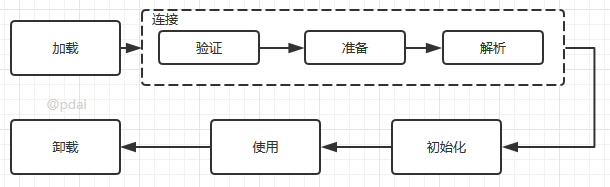

## Java基础-反射

1.反射基础

RTTI（Run-Time Type Identification）运行时类型识别。在《Thinking in Java》一书第十四章中有提到，其作用是在运行时识别一个对象的类型和类的信息。主要有两种方式：一种是“传统的”RTTI，它假定我们在编译时已经知道了所有的类型；另一种是“反射”机制，它允许我们在运行时发现和使用类的信息。

反射就是把java类中的各种成分映射成一个个的Java对象

例如：一个类有：成员变量、方法、构造方法、包等等信息，利用反射技术可以对一个类进行解剖，把个个组成部分映射成一个个对象。

> 这里我们首先需要理解 Class类，以及类的加载机制； 然后基于此我们如何通过反射获取Class类以及类中的成员变量、方法、构造方法等。

- Class类

  Class类，Class类也是一个实实在在的类，存在于JDK的java.lang包中。Class类的实例表示java应用运行时的类(class ans enum)或接口(interface and annotation)（每个java类运行时都在JVM里表现为一个class对象，可通过类名.class、类型.getClass()、Class.forName("类名")等方法获取class对象）。数组同样也被映射为class 对象的一个类，所有具有相同元素类型和维数的数组都共享该 Class 对象。基本类型boolean，byte，char，short，int，long，float，double和关键字void同样表现为 class  对象。

  ```java
  public final class Class<T> implements java.io.Serializable,
                                GenericDeclaration,
                                Type,
                                AnnotatedElement {
      private static final int ANNOTATION= 0x00002000;
      private static final int ENUM      = 0x00004000;
      private static final int SYNTHETIC = 0x00001000;
  
      private static native void registerNatives();
      static {
          registerNatives();
      }
  
      /*
       * Private constructor. Only the Java Virtual Machine creates Class objects.   //私有构造器，只有JVM才能调用创建Class对象
       * This constructor is not used and prevents the default constructor being
       * generated.
       */
      private Class(ClassLoader loader) {
          // Initialize final field for classLoader.  The initialization value of non-null
          // prevents future JIT optimizations from assuming this final field is null.
          classLoader = loader;
      }
  ```

  到这我们也就可以得出以下几点信息：

  - Class类也是类的一种，与class关键字是不一样的。
  - 手动编写的类被编译后会产生一个Class对象，其表示的是创建的类的类型信息，而且这个Class对象保存在同名.class的文件中(字节码文件)
  - 每个通过关键字class标识的类，在内存中有且只有一个与之对应的Class对象来描述其类型信息，无论创建多少个实例对象，其依据的都是用一个Class对象。
  - Class类只存私有构造函数，因此对应Class对象只能有JVM创建和加载
  - Class类的对象作用是运行时提供或获得某个对象的类型信息，这点对于反射技术很重要(关于反射稍后分析)。

- 类加载

  类加载机制和类字节码技术可以参考如下两篇文章：

  - JVM基础 - 类字节码详解
    - 源代码通过编译器编译为字节码，再通过类加载子系统进行加载到JVM中运行
  - JVM基础 - Java 类加载机制
    - 这篇文章将带你深入理解Java 类加载机制

  其中，这里我们需要回顾的是：

  1. 类加载机制流程

  

  1. 类的加载

  

2.反射的使用

在Java中，Class类与java.lang.reflect类库一起对反射技术进行了全力的支持。在反射包中，我们常用的类主要有Constructor类表示的是Class 对象所表示的类的构造方法，利用它可以在运行时动态创建对象、Field表示Class对象所表示的类的成员变量，通过它可以在运行时动态修改成员变量的属性值(包含private)、Method表示Class对象所表示的类的成员方法，通过它可以动态调用对象的方法(包含private)，下面将对这几个重要类进行分别说明。

- Class类对象的获取
- Constructor类及其用法
- Field类及其用法
- Method类及其用法

3.反射机制执行的流程

- 反射获取类实例
- 反射获取方法
- 调用 method.invoke() 方法
- 反射调用流程小结

4.参考文章

- https://www.codercto.com/a/46094.html
- https://blog.csdn.net/sinat_38259539/article/details/71799078
- https://blog.csdn.net/qq_40896997/article/details/94483820
- https://www.cnblogs.com/zhaoguhong/p/6937364.html
- https://juejin.im/post/5c160420e51d452a60684431
- https://blog.csdn.net/mcryeasy/java/article/details/52344729